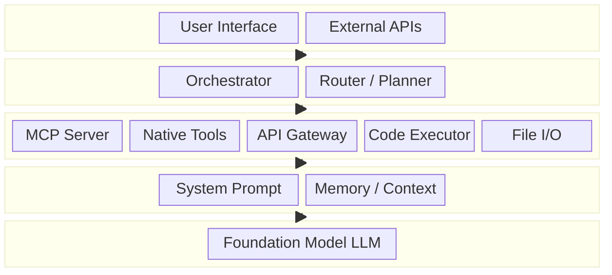
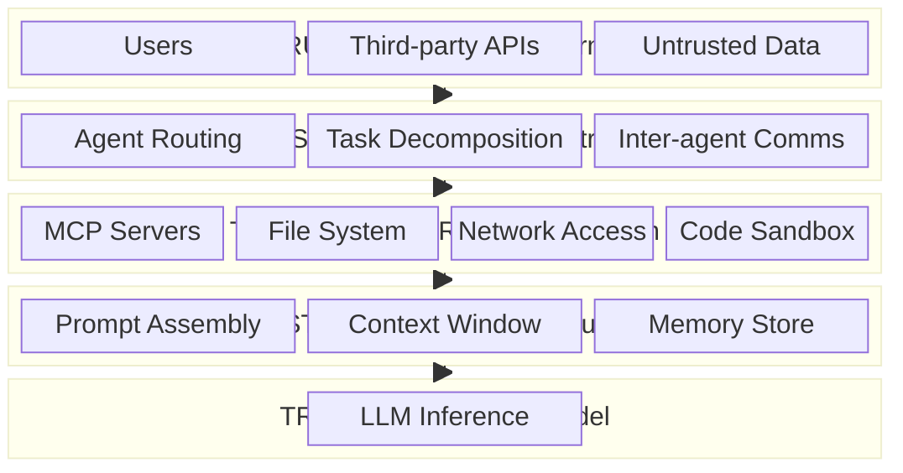
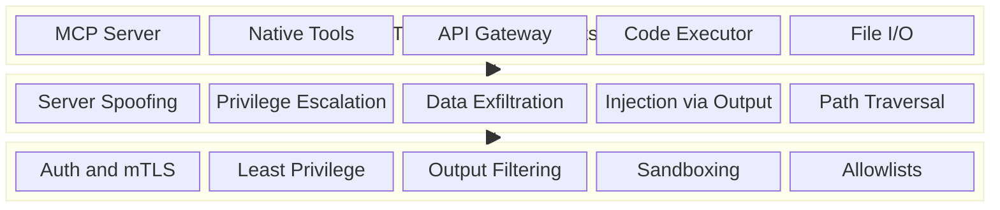

# Layered Agent Composition Threat Model

## Overview

This document defines a layered threat model for AI agent systems. It starts with a single-agent composition model — decomposing an agent into discrete layers — and identifies the trust boundaries, threat surfaces, and mitigations at each layer. This foundation will be extended to multi-agent orchestration, MCP integrations, and external API surfaces.

---

## 1. The Layered Model

An AI agent is not a monolith. It is a composition of five distinct layers, each with its own trust assumptions, inputs, and attack surface.

```
┌─────────────────────────────────────────────────┐
│  Layer 4: External Interface                    │
│  User inputs, API consumers, webhooks           │
├─────────────────────────────────────────────────┤
│  Layer 3: Orchestration                         │
│  Routing, planning, task decomposition          │
├─────────────────────────────────────────────────┤
│  Layer 2: Tool Integration                      │
│  MCP servers, function calls, code exec, RAG    │
├─────────────────────────────────────────────────┤
│  Layer 1: Agent Runtime                         │
│  System prompt, memory, context management      │
├─────────────────────────────────────────────────┤
│  Layer 0: Foundation Model                      │
│  LLM inference, token generation                │
└─────────────────────────────────────────────────┘
```

### Layer 0 — Foundation Model

The base LLM that generates token-level outputs. This layer is opaque to the agent developer.

| Attribute       | Detail                                      |
|-----------------|---------------------------------------------|
| **Components**  | LLM weights, inference engine, tokenizer    |
| **Inputs**      | Token sequences from Layer 1                |
| **Outputs**     | Generated tokens, logprobs                  |
| **Trust level** | Highest — assumed correct but not infallible |

### Layer 1 — Agent Runtime

The runtime that wraps the foundation model: system prompts, memory stores, context window management, and conversation state.

| Attribute       | Detail                                                     |
|-----------------|------------------------------------------------------------|
| **Components**  | System prompt, context window, memory/RAG, state manager   |
| **Inputs**      | User messages, tool results, retrieved context             |
| **Outputs**     | Assembled prompt sequences sent to Layer 0                 |
| **Trust level** | High — developer-controlled but accepts external data      |

### Layer 2 — Tool Integration

Tools the agent can invoke: MCP servers, native function calls, file I/O, code execution sandboxes, API gateways, and retrieval systems.

| Attribute       | Detail                                                          |
|-----------------|-----------------------------------------------------------------|
| **Components**  | MCP servers, native tools, code executor, file system, APIs     |
| **Inputs**      | Structured tool calls from agent, parameters, context           |
| **Outputs**     | Tool results injected back into agent context                   |
| **Trust level** | Medium — executes with real-world side effects                  |

### Layer 3 — Orchestration

The planning and routing logic that decomposes tasks, selects tools, and (in multi-agent systems) delegates to sub-agents.

| Attribute       | Detail                                                      |
|-----------------|-------------------------------------------------------------|
| **Components**  | Router, planner, task decomposer, agent selector            |
| **Inputs**      | High-level goals, intermediate results, agent capabilities  |
| **Outputs**     | Sub-tasks, tool invocations, agent delegations              |
| **Trust level** | Medium — makes consequential decisions about execution flow |

### Layer 4 — External Interface

The boundary between the agent system and the outside world: user interfaces, API endpoints, webhooks, and third-party integrations.

| Attribute       | Detail                                              |
|-----------------|------------------------------------------------------|
| **Components**  | Chat UI, REST/GraphQL APIs, webhooks, OAuth flows    |
| **Inputs**      | User messages, API requests, external events         |
| **Outputs**     | Agent responses, API responses, side effects         |
| **Trust level** | Lowest — fully untrusted input                       |

---

## 2. Trust Boundaries

Each layer transition is a trust boundary where data changes trust level. These are the critical points where validation, sanitization, and access control must be enforced.

```
┌──────────────────────────────────────────────────────────────┐
│ BOUNDARY 1: External → Orchestration                         │
│ Threat: Prompt injection, social engineering, input forgery  │
│ Control: Input validation, rate limiting, auth               │
├──────────────────────────────────────────────────────────────┤
│ BOUNDARY 2: Orchestration → Tool Execution                   │
│ Threat: Unauthorized tool use, privilege escalation          │
│ Control: Tool allowlists, capability-based permissions       │
├──────────────────────────────────────────────────────────────┤
│ BOUNDARY 3: Tool Execution → Agent Runtime                   │
│ Threat: Poisoned tool output, injection via results          │
│ Control: Output sanitization, result validation              │
├──────────────────────────────────────────────────────────────┤
│ BOUNDARY 4: Agent Runtime → Foundation Model                 │
│ Threat: Context poisoning, prompt leakage                    │
│ Control: Prompt assembly audit, context isolation            │
└──────────────────────────────────────────────────────────────┘
```

---

## 3. Threat Surface by Layer

### Layer 4 — External Interface Threats

| Threat                  | Description                                           | STRIDE   | Severity |
|-------------------------|-------------------------------------------------------|----------|----------|
| Direct prompt injection | Malicious instructions in user input                  | Tampering | Critical |
| Auth bypass             | Weak or missing authentication on API endpoints       | Spoofing  | Critical |
| Session hijacking       | Stolen tokens grant full agent access                 | Spoofing  | High     |
| Input flooding          | DoS via high-volume or large-payload requests         | DoS       | Medium   |
| Data harvesting         | Extracting training data or system prompts via output | Info Disc | High     |

### Layer 3 — Orchestration Threats

| Threat                   | Description                                            | STRIDE    | Severity |
|--------------------------|--------------------------------------------------------|-----------|----------|
| Goal hijacking           | Manipulated input redirects the planner's objective    | Tampering | Critical |
| Task injection           | Injected sub-tasks execute unintended operations       | Tampering | High     |
| Routing manipulation     | Forcing selection of a weaker or compromised sub-agent | Tampering | High     |
| Capability confusion     | Agent invokes tools outside its intended scope         | Elevation | High     |
| Decision audit gap       | No logging of why a routing decision was made          | Repud     | Medium   |

### Layer 2 — Tool Integration Threats

| Threat                   | Description                                               | STRIDE    | Severity |
|--------------------------|-----------------------------------------------------------|-----------|----------|
| MCP server spoofing      | Rogue server impersonates a legitimate MCP endpoint       | Spoofing  | Critical |
| Tool output poisoning    | Malicious data in tool results influences agent behavior  | Tampering | Critical |
| Data exfiltration        | Tool calls leak sensitive context to external services    | Info Disc | High     |
| Privilege escalation     | Tool executes with more permissions than intended         | Elevation | High     |
| Path traversal           | File I/O tools access outside allowed directories         | Tampering | High     |
| Code execution escape    | Sandbox breakout in code execution tools                  | Elevation | Critical |
| Dependency confusion     | Compromised packages loaded during code execution         | Tampering | High     |

### Layer 1 — Agent Runtime Threats

| Threat                    | Description                                              | STRIDE    | Severity |
|---------------------------|----------------------------------------------------------|-----------|----------|
| Indirect prompt injection | Malicious instructions embedded in retrieved documents   | Tampering | Critical |
| Context window poisoning  | Adversarial content fills context to displace instructions| Tampering | High     |
| Memory poisoning          | Persistent memory stores corrupted with bad data         | Tampering | High     |
| System prompt extraction  | Adversarial queries extract the system prompt            | Info Disc | Medium   |
| State desynchronization   | Conversation state diverges from actual system state     | Tampering | Medium   |

### Layer 0 — Foundation Model Threats

| Threat                 | Description                                             | STRIDE    | Severity |
|------------------------|---------------------------------------------------------|-----------|----------|
| Model poisoning        | Compromised fine-tuning introduces backdoors            | Tampering | Critical |
| Hallucination          | Confident but incorrect outputs drive wrong actions     | Integrity | High     |
| Alignment bypass       | Adversarial prompts circumvent safety guardrails        | Elevation | Critical |
| Token-level attacks    | Crafted token sequences trigger unintended behavior     | Tampering | High     |
| Model supply chain     | Tampered model weights or quantization artifacts        | Tampering | Critical |

---

## 4. Controls Matrix

| Layer | Control                    | Description                                              |
|-------|----------------------------|----------------------------------------------------------|
| L4    | Input validation           | Schema validation, length limits, content filtering      |
| L4    | Authentication             | OAuth 2.0 / API keys with scoped permissions             |
| L4    | Rate limiting              | Per-user and per-endpoint throttling                     |
| L3    | Tool allowlists            | Explicit list of permitted tools per agent role          |
| L3    | Decision logging           | Immutable audit trail of routing and planning decisions  |
| L3    | Capability boundaries      | Agents can only invoke tools in their declared scope     |
| L2    | MCP server auth            | mTLS or token-based auth for all MCP connections         |
| L2    | Output sanitization        | Strip or escape tool outputs before context injection    |
| L2    | Sandboxed execution        | Code runs in isolated containers with no network         |
| L2    | Filesystem allowlists      | Restrict file I/O to declared directory scopes           |
| L1    | Prompt assembly audit      | Log and review assembled prompts for injection           |
| L1    | Context isolation          | Separate user content from system instructions           |
| L1    | Memory validation          | Verify memory entries before retrieval and injection     |
| L0    | Model provenance           | Verify model checksums and supply chain integrity        |
| L0    | Output guardrails          | Post-generation filtering for harmful or incorrect output|

---

## 5. Data Flow — Single Agent

```
User Input                Tool Results
    │                         │
    ▼                         ▼
┌──────────┐          ┌──────────────┐
│ Layer 4  │          │   Layer 2    │
│ External │──────▶   │    Tools     │
│ Interface│          │  MCP / APIs  │
└────┬─────┘          └──────▲───────┘
     │                       │
     ▼                       │
┌──────────┐          ┌──────┴───────┐
│ Layer 3  │──────▶   │   Layer 1    │
│ Orchestr.│          │   Runtime    │
└──────────┘          └──────┬───────┘
                             │
                             ▼
                      ┌──────────────┐
                      │   Layer 0    │
                      │  Foundation  │
                      │    Model     │
                      └──────────────┘
```

---

## 6. Mermaid Diagrams

The following Mermaid diagrams provide visual representations of this model. Render them with any Mermaid-compatible tool.

### 6.1 Layered Agent Composition



### 6.2 Trust Boundaries and Threat Surfaces



### 6.3 Tool Integration Threat Surface



---

## 7. Next Steps

This single-agent layered model is the foundation. The following expansions are planned:

1. **Multi-Agent Threat Model** — Extend to agent-to-agent communication, shared memory, delegation chains, and confused deputy attacks
2. **MCP Deep Dive** — Detailed threat model for MCP server lifecycle: discovery, authentication, tool registration, result handling
3. **API Surface Threat Model** — External API attack surface including OAuth flows, webhook verification, and rate limiting
4. **Supply Chain Threats** — Model provenance, tool/plugin supply chain, dependency integrity
5. **Operational Threat Model** — Logging, monitoring, incident response for agent systems in production
