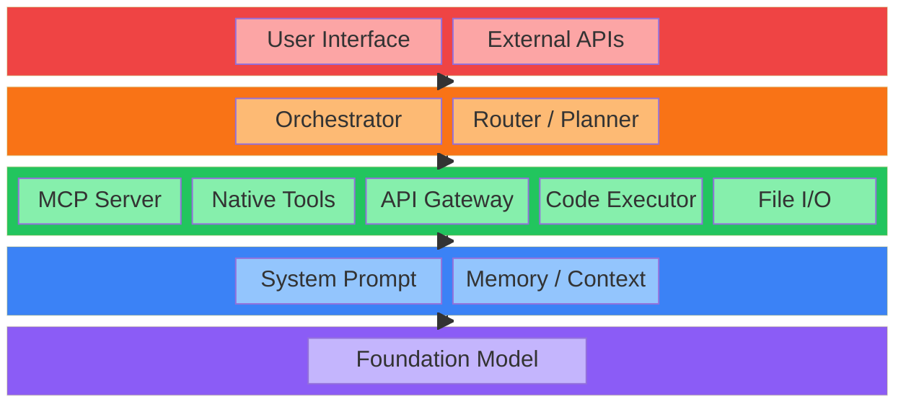
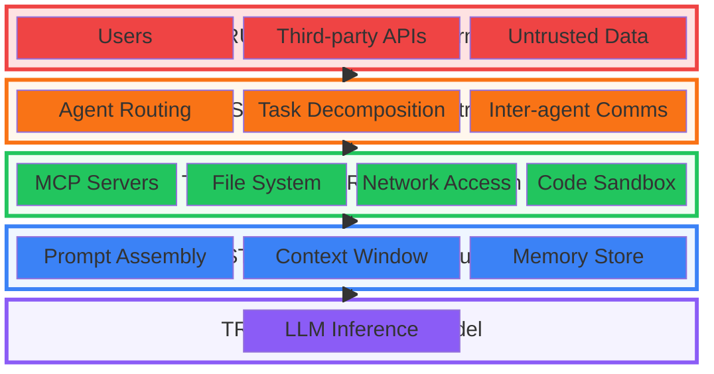
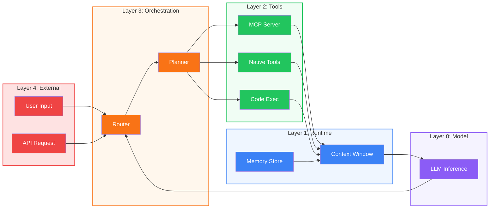
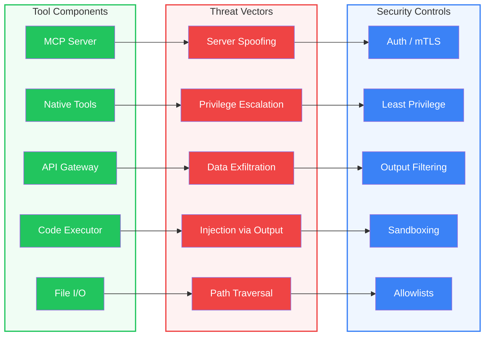

# Multi-Agent Threat Model

A layered threat model for AI agent systems — from foundation models to multi-agent orchestration.

  <a href="#/layer-0-foundation-model" class="l0">Layer 0: Foundation Model</a>
  <a href="#/layer-1-agent-runtime" class="l1">Layer 1: Agent Runtime</a>
  <a href="#/layer-2-tool-integration" class="l2">Layer 2: Tool Integration</a>
  <a href="#/layer-3-orchestration" class="l3">Layer 3: Orchestration</a>
  <a href="#/layer-4-external-interface" class="l4">Layer 4: External Interface</a>

---

## The Layered Model

An AI agent is not a monolith. It is a composition of five distinct layers, each with its own trust assumptions, inputs, and attack surface.

| Layer | Name | Responsibility | Trust Level |
|-------|------|----------------|-------------|
| **L4** | External Interface | User inputs, API consumers, webhooks | Lowest — fully untrusted |
| **L3** | Orchestration | Routing, planning, task decomposition | Medium — consequential decisions |
| **L2** | Tool Integration | MCP servers, function calls, code exec, RAG | Medium — real-world side effects |
| **L1** | Agent Runtime | System prompt, memory, context management | High — controls what the LLM sees |
| **L0** | Foundation Model | LLM inference, token generation | Highest — opaque but assumed correct |

---

## Trust Boundaries

Each layer transition is a trust boundary. Data crosses these boundaries with different trust levels, and each crossing is a potential attack vector.

### Boundary Threat Summary

| Boundary | Crossing | Key Threats |
|----------|----------|-------------|
| **B1: External to Orchestration** | Untrusted user input enters the system | Prompt injection, social engineering, input forgery |
| **B2: Orchestration to Tools** | Agent decisions trigger real-world actions | Unauthorized tool use, privilege escalation |
| **B3: Tools to Runtime** | Tool results re-enter agent context | Poisoned output, injection via results |
| **B4: Runtime to Model** | Assembled prompt sent to LLM | Context poisoning, prompt leakage |

---

## Data Flow

How data moves through a single agent, from user input to model inference and back.

---

## Tool Integration Threat Surface

The tool layer bridges the AI system with real-world side effects. Each tool type has a corresponding threat vector and required control.

---

## Controls Matrix

| Layer | Control | Description |
|-------|---------|-------------|
| L4 | Input validation | Schema validation, length limits, content filtering |
| L4 | Authentication | OAuth 2.0 / API keys with scoped permissions |
| L4 | Rate limiting | Per-user and per-endpoint throttling |
| L3 | Tool allowlists | Explicit list of permitted tools per agent role |
| L3 | Decision logging | Immutable audit trail of routing and planning decisions |
| L3 | Capability boundaries | Agents can only invoke tools in their declared scope |
| L2 | MCP server auth | mTLS or token-based auth for all MCP connections |
| L2 | Output sanitization | Strip or escape tool outputs before context injection |
| L2 | Sandboxed execution | Code runs in isolated containers with no network |
| L2 | Filesystem allowlists | Restrict file I/O to declared directory scopes |
| L1 | Prompt assembly audit | Log and review assembled prompts for injection |
| L1 | Context isolation | Separate user content from system instructions |
| L1 | Memory validation | Verify memory entries before retrieval and injection |
| L0 | Model provenance | Verify model checksums and supply chain integrity |
| L0 | Output guardrails | Post-generation filtering for harmful or incorrect output |

---

## Next Steps

This single-agent layered model is the foundation. Planned expansions:

1. **Multi-Agent Threat Model** — Agent-to-agent communication, shared memory, delegation chains, confused deputy attacks
2. **MCP Deep Dive** — Detailed threat model for MCP server lifecycle
3. **API Surface Threat Model** — External API attack surface
4. **Supply Chain Threats** — Model provenance, tool/plugin supply chain
5. **Operational Threat Model** — Logging, monitoring, incident response
