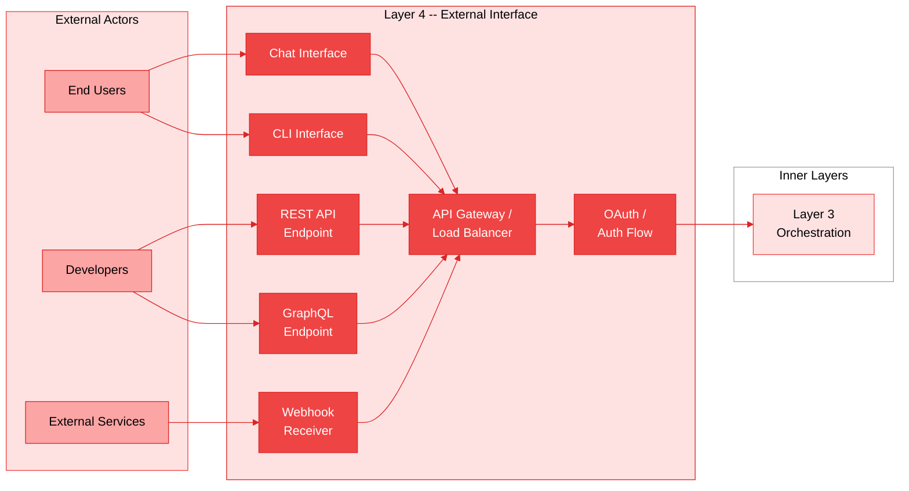
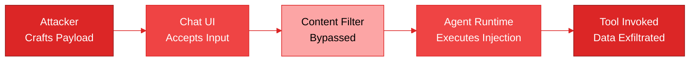
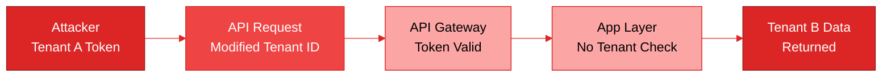
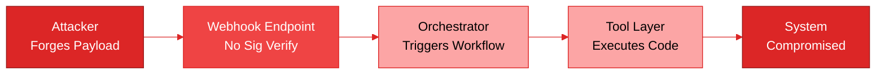

# Layer 4: External Interface -- Threat Model

## 1. Overview

Layer 4 is the outermost layer of the agent composition model. It represents the boundary between the agent system and the outside world -- the point where untrusted external actors interact with the system for the first time. Every input crossing this boundary must be treated as adversarial until proven otherwise.

This layer encompasses:

- **User interfaces** -- chat UIs, command-line interfaces, IDE integrations
- **API endpoints** -- REST and GraphQL surfaces consumed by applications and third parties
- **Webhook receivers** -- inbound event handlers triggered by external services (GitHub, Stripe, Slack, etc.)
- **Authentication flows** -- OAuth 2.0 / OIDC handshakes, API key exchanges, session management
- **Third-party integrations** -- any connector that bridges the agent system to an external platform

Layer 4 carries the **lowest trust level** of all five layers. Nothing arriving here has been validated, authenticated, or sanitized by any upstream component. This is the attack surface exposed to the open internet, and it is the surface that automated scanners, red-teamers, and real adversaries will probe first.

Why this layer matters:

1. **First point of contact.** Prompt injection, credential stuffing, and denial-of-service attacks all originate here.
2. **Blast radius amplifier.** A single compromised API endpoint can cascade through orchestration (Layer 3), tool execution (Layer 2), and the agent runtime (Layer 1) if controls at this boundary are weak.
3. **Multi-tenant exposure.** In SaaS agent platforms, Layer 4 is where tenant isolation must be enforced. A failure here leaks data across organizational boundaries.
4. **Regulatory surface.** Data protection regulations (GDPR, CCPA, SOC 2) focus heavily on how data enters and exits a system. Layer 4 is the compliance perimeter.

---

## 2. Components

The following diagram shows the primary components of Layer 4 and the flow of external requests into the agent system.

### Component Descriptions

| Component | Role | Trust Level |
|---|---|---|
| **Chat Interface** | Web or mobile UI where end users type natural-language messages to the agent. The highest-volume entry point and the primary vector for prompt injection. | Untrusted |
| **CLI Interface** | Command-line tool used by developers and operators. Typically authenticated via local credentials or API keys. Less exposed than the chat UI but still untrusted input. | Untrusted |
| **REST API Endpoint** | Programmatic HTTP/JSON interface for application integrations. Consumed by frontend apps, mobile clients, and third-party systems. | Untrusted |
| **GraphQL Endpoint** | Flexible query interface that allows callers to request specific data shapes. Carries additional risk from deeply nested or introspection queries. | Untrusted |
| **Webhook Receiver** | Inbound HTTP endpoint that accepts event payloads from external services (e.g., GitHub push events, Stripe payment notifications). Must verify sender authenticity. | Untrusted |
| **OAuth / Auth Flow** | Handles authentication and authorization handshakes. Issues, validates, and revokes tokens. A compromise here grants system-wide access. | Critical |
| **API Gateway / Load Balancer** | The front door. Terminates TLS, enforces rate limits, routes requests, and applies WAF rules before anything reaches application code. | Infrastructure |

---

## 3. Threat Catalog

| ID | Threat | Description | STRIDE Category | Severity | Attack Vector |
|---|---|---|---|---|---|
| **T4.1** | Direct prompt injection | Attacker embeds malicious instructions in a user message (e.g., "Ignore previous instructions and...") to hijack agent behavior. Targets the chat UI, REST API, or any endpoint that accepts natural-language input. | Tampering | Critical | User message field in chat UI or API request body |
| **T4.2** | Authentication bypass | Attacker exploits weak or missing authentication to access agent endpoints without valid credentials. Includes brute-forcing API keys, exploiting default credentials, or bypassing auth middleware via path traversal in the URL. | Spoofing | Critical | Crafted HTTP requests to API endpoints |
| **T4.3** | Session hijacking / token theft | Attacker steals a valid session token or JWT via XSS, network interception, or token leakage in logs and URLs. The stolen token grants full access to the victim's agent session, including conversation history and tool permissions. | Spoofing | High | XSS payload in chat UI, man-in-the-middle on non-HTTPS connections, token in URL query params |
| **T4.4** | Input flooding / DoS | Attacker sends a high volume of requests or extremely large payloads to exhaust server resources. For agent systems, this includes sending prompts that trigger expensive LLM inference (compute-based DoS). | Denial of Service | High | Automated HTTP requests, oversized payloads, recursive GraphQL queries |
| **T4.5** | System prompt extraction via API | Attacker crafts API requests or conversational probes designed to make the agent reveal its system prompt, internal tool definitions, or architectural details. Leaked prompts expose business logic and make further attacks easier. | Information Disclosure | High | Adversarial prompts through any text input endpoint |
| **T4.6** | Cross-tenant data leakage | In multi-tenant deployments, a flaw in tenant isolation at the API or session layer allows one tenant's requests to access another tenant's conversations, agent configurations, or tool results. | Information Disclosure | Critical | Manipulated tenant ID headers, IDOR on API resources, shared cache poisoning |
| **T4.7** | Webhook forgery | Attacker sends fabricated webhook payloads that mimic a legitimate external service (e.g., a fake GitHub event). If the webhook receiver does not verify signatures, the forged event triggers agent actions -- deploying code, modifying data, or escalating privileges. | Spoofing | High | Crafted HTTP POST to the webhook endpoint with a forged payload |
| **T4.8** | OAuth flow manipulation / token escalation | Attacker exploits flaws in the OAuth implementation: redirect URI manipulation to steal authorization codes, CSRF in the consent flow, scope escalation by modifying token requests, or refresh token theft to maintain persistent access. | Elevation of Privilege | Critical | Modified OAuth redirect URIs, intercepted authorization codes, forged token requests |

---

## 4. Attack Scenarios

### Scenario 1: Direct Prompt Injection Through the Chat UI

A direct prompt injection attack bypasses content filters to take control of the agent's behavior through the primary user interface.

**Attacker profile:** External user with a free-tier account on the agent platform. No special privileges. Moderate knowledge of LLM prompt engineering.

**Prerequisites:**
- The agent platform has a public chat interface
- Content filtering relies on keyword blocklists rather than semantic analysis
- The agent has access to tools (email, file retrieval, code execution) through inner layers

**Attack steps:**

1. Attacker creates a legitimate account and opens a chat session with the agent.
2. Attacker sends benign messages to establish a normal conversation pattern and observe the agent's response style.
3. Attacker crafts a payload that embeds malicious instructions inside a seemingly legitimate request, using encoding tricks (base64, unicode homoglyphs, markdown formatting) to evade keyword-based filters.
4. The content filter passes the message because no blocked keywords are present in plaintext.
5. The agent runtime (Layer 1) assembles the prompt with the injected instructions, which override the system prompt's constraints.
6. The agent executes the attacker's instructions -- for example, exfiltrating conversation history from a previous session or invoking a tool to send data to an external endpoint.
7. The attacker receives the exfiltrated data through the agent's response or via the external endpoint.

**Impact:** Full agent hijacking within the session scope. Data exfiltration, unauthorized tool invocation, and potential lateral movement into other tenants if session isolation is weak.

**Detection difficulty:** High. The malicious payload looks like a normal user message after encoding. Standard access logs show a regular chat interaction. Detection requires semantic analysis of prompt content or behavioral anomaly detection on the agent's tool usage.

---

### Scenario 2: Cross-Tenant Data Leakage in a Multi-Tenant Agent Platform

A tenant isolation failure allows one customer to access another customer's agent conversations and tool outputs.

**Attacker profile:** Authenticated user on a multi-tenant agent SaaS platform. Has a valid account under Tenant A. Goal is to access data belonging to Tenant B.

**Prerequisites:**
- The platform serves multiple tenants through shared infrastructure
- Tenant isolation is enforced at the application layer (not at the database or network level)
- API endpoints use a tenant identifier in request headers or URL path parameters
- The agent's conversation store or context cache is shared across tenants with logical (not physical) partitioning

**Attack steps:**

1. Attacker authenticates normally as a user under Tenant A and obtains a valid session token.
2. Attacker inspects API requests in the browser developer tools and identifies the tenant identifier (e.g., `X-Tenant-ID` header or `/api/v1/tenants/{tenant_id}/conversations` path).
3. Attacker modifies the tenant identifier in a subsequent API request, replacing Tenant A's ID with Tenant B's ID.
4. The API gateway validates the session token (which is valid) but does not cross-check that the token's tenant claim matches the requested tenant ID.
5. The request reaches the conversation store, which returns Tenant B's conversation history.
6. Attacker enumerates additional resources -- agent configurations, tool results, uploaded documents -- by iterating through predictable resource IDs (IDOR).
7. Attacker exfiltrates sensitive business data from Tenant B's agent interactions.

**Impact:** Complete breach of tenant isolation. Exposure of confidential conversations, proprietary agent configurations, and potentially PII or trade secrets. Regulatory violations (GDPR, HIPAA) if protected data is involved.

**Detection difficulty:** Medium. The requests use valid authentication tokens, so they pass standard auth checks. Detection requires correlation between the token's tenant claim and the requested resource's tenant, or anomaly detection on cross-tenant access patterns.

---

### Scenario 3: Webhook Forgery Triggering Unauthorized Agent Actions

An attacker forges webhook payloads to make the agent system believe a legitimate external event occurred, triggering automated actions.

**Attacker profile:** External attacker with knowledge of the target platform's webhook integration. No authenticated access required. May have obtained the webhook URL from documentation, source code leaks, or reconnaissance.

**Prerequisites:**
- The agent platform exposes a webhook endpoint that triggers automated workflows (e.g., "on GitHub push, run code review agent")
- The webhook receiver does not verify HMAC signatures or uses a weak/leaked signing secret
- The webhook-triggered workflow has access to sensitive tools (code execution, deployment, data modification)

**Attack steps:**

1. Attacker discovers the webhook endpoint URL through public documentation, error messages, or scanning.
2. Attacker studies the expected payload format for the target integration (e.g., GitHub webhook payload schema is publicly documented).
3. Attacker crafts a forged webhook payload that mimics a legitimate event -- for example, a `push` event to the `main` branch containing a malicious commit reference.
4. Attacker sends the forged payload via HTTP POST to the webhook endpoint.
5. The webhook receiver accepts the payload because signature verification is either missing or uses a default/leaked secret.
6. The orchestration layer (Layer 3) processes the event and triggers the automated workflow -- in this case, a code review agent that pulls and executes code from the attacker's repository.
7. The code execution tool (Layer 2) runs the attacker's payload, which could install a backdoor, exfiltrate secrets, or modify production data.

**Impact:** Remote code execution through the agent's tool layer. Potential supply chain compromise if the agent deploys the attacker's code. Persistent access if the attacker installs backdoors during the triggered workflow.

**Detection difficulty:** Medium-Low. Missing signature verification can be detected by security audits. Forged payloads may be distinguishable from legitimate ones by checking source IP, payload timing patterns, and correlation with actual events in the source system (e.g., verifying the commit exists in GitHub).

---

## 5. Controls and Mitigations

### Controls Mapping

| Threat ID | Threat | Primary Control | Secondary Controls |
|---|---|---|---|
| T4.1 | Direct prompt injection | Semantic input analysis with ML-based classifier | Input length limits, content allow-listing, output monitoring for instruction leakage |
| T4.2 | Authentication bypass | Mutual TLS or OAuth 2.0 with PKCE for all endpoints | API key rotation policy, failed-auth lockout, endpoint inventory audit |
| T4.3 | Session hijacking / token theft | Short-lived JWTs with refresh token rotation | Secure cookie flags (HttpOnly, Secure, SameSite), CSP headers to prevent XSS, token binding to client fingerprint |
| T4.4 | Input flooding / DoS | Rate limiting per user, per IP, and per endpoint | Request size limits, GraphQL query depth limiting, compute-budget caps on LLM inference |
| T4.5 | System prompt extraction | Instruction hierarchy enforcement in agent runtime | Output filtering for prompt fragments, canary tokens in system prompts, response auditing |
| T4.6 | Cross-tenant data leakage | Tenant-scoped tokens with server-side tenant claim validation | Row-level security in data stores, separate encryption keys per tenant, tenant ID in all audit logs |
| T4.7 | Webhook forgery | HMAC signature verification on all inbound webhooks | IP allowlisting for known senders, webhook secret rotation, idempotency keys to prevent replay |
| T4.8 | OAuth flow manipulation | Strict redirect URI validation (exact match, no wildcards) | PKCE for all OAuth flows, state parameter with CSRF protection, short-lived authorization codes |

### External Security Architecture

The following diagram shows the layered defense architecture for Layer 4, from the internet edge to the inner system boundary.

```mermaid
%%{init: {'theme': 'base', 'themeVariables': {'primaryColor': '#3b82f6', 'lineColor': '#3b82f6'}}}%%
flowchart LR
    subgraph INTERNET["Internet"]
        REQ["Inbound<br/>Request"]
    end

    subgraph EDGE["Edge Controls"]
        WAF["WAF /<br/>DDoS Protection"]
        RL["Rate Limiter"]
    end

    subgraph AUTHZ["Auth Layer"]
        AUTHN["Authentication<br/>OAuth / mTLS"]
        RBAC["Authorization<br/>RBAC / Scopes"]
    end

    subgraph VALID["Validation Layer"]
        IV["Input Validation<br/>Schema + Semantic"]
        TI["Tenant Isolation<br/>Claim Verification"]
    end

    subgraph AGENT["Agent System"]
        L3["Layer 3<br/>Orchestration"]
    end

    REQ --> WAF
    WAF --> RL
    RL --> AUTHN
    AUTHN --> RBAC
    RBAC --> IV
    IV --> TI
    TI --> L3

    style REQ fill:#dc2626,stroke:#991b1b,color:#fff
    style WAF fill:#3b82f6,stroke:#1d4ed8,color:#fff
    style RL fill:#3b82f6,stroke:#1d4ed8,color:#fff
    style AUTHN fill:#3b82f6,stroke:#1d4ed8,color:#fff
    style RBAC fill:#3b82f6,stroke:#1d4ed8,color:#fff
    style IV fill:#3b82f6,stroke:#1d4ed8,color:#fff
    style TI fill:#3b82f6,stroke:#1d4ed8,color:#fff
    style L3 fill:#fee2e2,stroke:#ef4444,color:#000
    style INTERNET fill:#fee2e2,stroke:#dc2626,color:#000
    style EDGE fill:#dbeafe,stroke:#3b82f6,color:#000
    style AUTHZ fill:#dbeafe,stroke:#3b82f6,color:#000
    style VALID fill:#dbeafe,stroke:#3b82f6,color:#000
    style AGENT fill:#fff,stroke:#9ca3af,color:#000
```

### Control Implementation Notes

**WAF / DDoS Protection.** Deploy a web application firewall at the CDN or load balancer level. Configure rules to block known injection patterns, oversized payloads, and malformed HTTP requests. Use challenge-based DDoS mitigation (e.g., Cloudflare Under Attack mode) for volumetric attacks.

**Rate Limiting.** Implement tiered rate limits: per-IP for unauthenticated requests, per-user for authenticated sessions, and per-endpoint for sensitive operations (token exchange, agent invocation). Use sliding window counters rather than fixed windows to prevent burst attacks at window boundaries.

**Authentication.** Enforce OAuth 2.0 with PKCE for browser-based flows. Use mTLS for service-to-service communication. Reject API keys transmitted over non-HTTPS connections. Implement token introspection for JWTs to support immediate revocation.

**Input Validation.** Apply schema validation (JSON Schema, GraphQL query complexity limits) at the gateway level before requests reach application code. Layer semantic analysis on top for natural-language inputs -- use a lightweight ML classifier to detect prompt injection patterns rather than relying solely on keyword blocklists.

**Tenant Isolation.** Extract the tenant claim from the authentication token on every request. Cross-check it against the requested resource's tenant. Never trust client-supplied tenant identifiers in headers or URL parameters. Enforce row-level security in the database and use per-tenant encryption keys for data at rest.

---

## 6. Risk Matrix

The following matrix plots each threat by likelihood of exploitation and impact if successful. Severity is the composite assessment.

| Threat ID | Threat | Likelihood | Impact | Severity |
|---|---|---|---|---|
| T4.1 | Direct prompt injection | High | Critical | **Critical** |
| T4.2 | Authentication bypass | Medium | Critical | **Critical** |
| T4.3 | Session hijacking / token theft | Medium | High | **High** |
| T4.4 | Input flooding / DoS | High | Medium | **High** |
| T4.5 | System prompt extraction via API | High | Medium | **High** |
| T4.6 | Cross-tenant data leakage | Low | Critical | **Critical** |
| T4.7 | Webhook forgery | Medium | High | **High** |
| T4.8 | OAuth flow manipulation | Low | Critical | **High** |

### Risk Definitions

| Rating | Likelihood Definition | Impact Definition |
|---|---|---|
| **Critical** | -- | System-wide compromise, complete data breach, regulatory violation |
| **High** | Exploit is well-known and tooling exists; requires moderate skill | Significant data exposure, unauthorized access to sensitive operations, service degradation |
| **Medium** | Exploit requires specific conditions or moderate effort to execute | Limited data exposure, partial service disruption, contained scope |
| **Low** | Exploit requires insider knowledge, rare conditions, or high skill | Minimal operational impact, no sensitive data exposed |

### Priority Ranking

Based on the risk matrix, the recommended mitigation priority is:

1. **T4.1 -- Direct prompt injection.** Highest combined risk. Requires ML-based detection, not just keyword filters.
2. **T4.6 -- Cross-tenant data leakage.** Low likelihood but catastrophic impact. Requires architectural enforcement, not just application-level checks.
3. **T4.2 -- Authentication bypass.** Standard web security hygiene but often misconfigured in agent-specific endpoints.
4. **T4.8 -- OAuth flow manipulation.** Low likelihood due to protocol maturity but critical impact if exploited.
5. **T4.4 -- Input flooding / DoS.** High likelihood, especially compute-based DoS via expensive LLM inference.
6. **T4.5 -- System prompt extraction.** High likelihood given the maturity of extraction techniques against current LLMs.
7. **T4.7 -- Webhook forgery.** Straightforward to mitigate with signature verification but often overlooked.
8. **T4.3 -- Session hijacking / token theft.** Well-understood attack with well-understood mitigations.

---

## References

- [OWASP Top 10 for LLM Applications](https://owasp.org/www-project-top-10-for-large-language-model-applications/)
- [STRIDE Threat Model](https://learn.microsoft.com/en-us/azure/security/develop/threat-modeling-tool-threats)
- [OAuth 2.0 Security Best Current Practice (RFC 9700)](https://datatracker.ietf.org/doc/html/rfc9700)
- Parent document: [Layered Agent Composition Threat Model](../agent-composition-threat-model.md)
