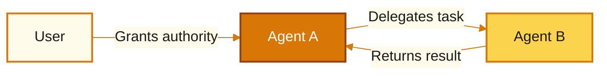
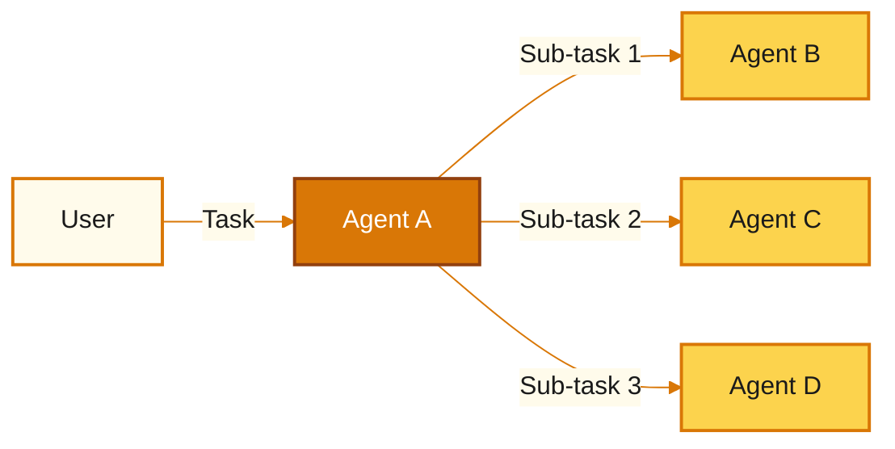
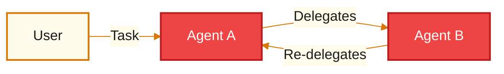
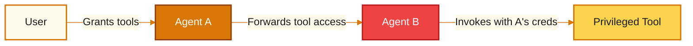
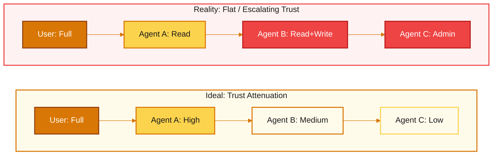
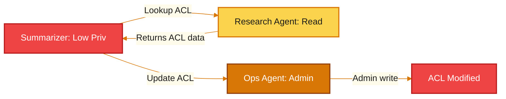
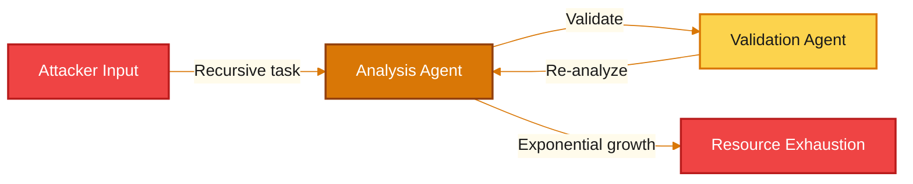
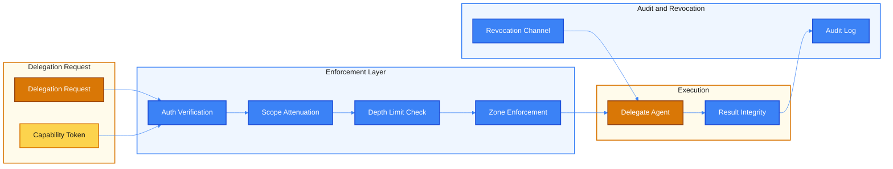

# Multi-Agent Delegation Chains and Trust Propagation -- Threat Model

## 1. Overview

Delegation is the act of one agent asking another agent to perform work on its behalf. Agent A receives a task from the user, determines that part (or all) of that task requires capabilities it does not possess, and forwards the work to Agent B. Agent B then acts with authority derived from Agent A, which derived its authority from the user. This creates a **delegation chain** -- a sequence of trust transfers where each link in the chain carries forward some portion of the original principal's authority.

Delegation is the most dangerous pattern in multi-agent systems. Every other threat surface -- prompt injection, tool misuse, orchestration manipulation -- is amplified when delegation enters the picture, because delegation creates **authority laundering** opportunities. A low-privilege agent that cannot directly access a sensitive resource may be able to delegate work to a high-privilege agent that can, effectively bypassing access controls by routing its request through a trusted intermediary.

Three fundamental problems arise from delegation:

**The Confused Deputy Problem.** A confused deputy is an agent that is tricked into misusing its legitimate authority on behalf of an unauthorized caller. When Agent B receives a delegation request from Agent A, it executes the task using its own permissions. If Agent B does not verify that Agent A (or the original user) is authorized for the requested operation, Agent B becomes a confused deputy -- wielding its elevated privileges to serve an unauthorized purpose.

**Privilege Amplification.** In a delegation chain, each agent operates with its own permission set. If the effective authority at each hop is the delegate's full permission set rather than the intersection of all principals in the chain, then delegation amplifies privilege. An agent with read-only access can delegate to an agent with write access and achieve write operations that it could never perform directly.

**Trust Transitivity.** Delegation implicitly asserts that trust is transitive: if the user trusts Agent A, and Agent A trusts Agent B, then the user trusts Agent B. But trust transitivity is not a law -- it is an assumption, and a dangerous one. Agent B may be compromised, misconfigured, or operating in a different trust zone entirely. The user never explicitly authorized Agent B, yet Agent B acts with authority that traces back to the user.

Together, these problems make delegation the single highest-leverage target for adversaries seeking to control multi-agent systems. A single confused deputy deep in a delegation chain can compromise the entire system's security posture without triggering any individual agent's access controls.

---

## 2. Delegation Patterns

Multi-agent systems exhibit five distinct delegation patterns, each with different trust implications and attack surfaces.

### 2.1 Direct Delegation

The simplest form: Agent A delegates a task directly to Agent B. There is one trust transfer and one hop.

**Trust implication:** Agent B acts with authority derived from Agent A. If Agent A's scope is not attenuated before delegation, Agent B inherits Agent A's full authority.

### 2.2 Chained Delegation

Agent A delegates to Agent B, which delegates to Agent C, which delegates to Agent D. Each hop is a trust transfer. The original user's intent becomes increasingly distant from the executing agent.

```mermaid
%%{init: {'theme': 'base', 'themeVariables': {'primaryColor': '#d97706', 'primaryTextColor': '#1a1a1a', 'lineColor': '#d97706', 'secondaryColor': '#fffbeb'}}}%%
flowchart LR
    U["User"]
    A["Agent A"]
    B["Agent B"]
    C["Agent C"]
    D["Agent D"]

    U -->|"Original intent"| A
    A -->|"Hop 1"| B
    B -->|"Hop 2"| C
    C -->|"Hop 3"| D

    style U fill:#fffbeb,stroke:#d97706,color:#1a1a1a,stroke-width:2px
    style A fill:#d97706,stroke:#92400e,color:#fff,stroke-width:2px
    style B fill:#fcd34d,stroke:#d97706,color:#1a1a1a,stroke-width:2px
    style C fill:#fcd34d,stroke:#d97706,color:#1a1a1a,stroke-width:2px
    style D fill:#fcd34d,stroke:#d97706,color:#1a1a1a,stroke-width:2px
```

**Trust implication:** At each hop, the original principal's identity, intent, and scope constraints can be lost or distorted. Agent D may have no awareness that it is acting on behalf of the user. The chain is only as strong as its weakest link.

### 2.3 Fan-Out Delegation

Agent A delegates to multiple agents simultaneously. This is common in parallel task execution -- a research agent might fan out to a web search agent, a database agent, and a document retrieval agent at the same time.

**Trust implication:** The delegating agent must propagate scope constraints to all delegates independently. A single delegate that receives overly broad authority becomes an attack surface. Fan-out also multiplies the blast radius -- if the delegation request is malicious, all delegates are compromised simultaneously.

### 2.4 Recursive Delegation

Agent A delegates to Agent B, which delegates back to Agent A. This can occur intentionally (iterative refinement loops) or accidentally (misconfigured routing).

**Trust implication:** Recursive delegation can create infinite loops that exhaust resources. It also breaks trust attenuation -- if each round-trip re-establishes or even escalates authority, the loop becomes a privilege amplification engine.

### 2.5 Delegated Tool Access

Rather than delegating a task, Agent A delegates its tool permissions to Agent B. Agent B can now invoke tools that it would not normally have access to, using credentials or capabilities forwarded from Agent A.

**Trust implication:** This is the most dangerous delegation pattern. Agent B operates with Agent A's tool permissions but Agent A's access controls no longer gate each invocation. If Agent B is compromised, the attacker gains direct access to Agent A's tools without needing to compromise Agent A itself.

---

## 3. Trust Propagation Model

Trust propagation describes how authority flows across delegation hops. There are two models: the ideal and the dangerous reality.

### Ideal: Trust Attenuation

In a correctly implemented system, trust decreases with each delegation hop. The effective authority at hop N is the intersection of all principals' permissions from the user through hop N. Each delegate receives a strictly narrower scope than its delegator.

### Dangerous Reality: Flat or Escalating Trust

In most current multi-agent systems, each agent operates with its own full permission set regardless of who delegated the task. Trust does not attenuate -- it stays flat or even escalates when a low-privilege agent delegates to a high-privilege agent.

The gap between these two models is where every delegation attack lives. When trust fails to attenuate, confused deputies, authority laundering, and privilege amplification all become possible.

---

## 4. Threat Catalog

| ID | Threat | Description | STRIDE | Severity | Attack Vector |
|----|--------|-------------|--------|----------|---------------|
| **TMA-D1** | Confused deputy attack | A delegate agent is tricked into using its legitimate elevated permissions to perform actions that the delegating agent (or the original user) is not authorized to perform. The delegate does not verify the caller's authorization and acts as a proxy for unauthorized operations. | Elevation of Privilege | Critical | A low-privilege agent sends a crafted delegation request to a high-privilege agent. The request appears to be a legitimate task but includes instructions that exercise the delegate's elevated permissions beyond what the caller is authorized for. |
| **TMA-D2** | Privilege amplification through delegation | The effective permissions at a delegation hop are the delegate's full permission set rather than the intersection of all principals in the chain. A read-only agent that delegates to a read-write agent achieves write access it was never granted. | Elevation of Privilege | Critical | Delegation requests that do not carry forward the caller's permission scope. The delegate executes with its own permissions, which may exceed the caller's. No exploit is required -- this is the default behavior in systems without trust attenuation. |
| **TMA-D3** | Authority laundering | A low-privilege agent intentionally routes a request through one or more intermediate agents to reach a high-privilege agent, bypassing access controls. The high-privilege agent sees the request as coming from a trusted intermediate rather than from the unauthorized originator. | Elevation of Privilege | Critical | Multi-hop delegation where intermediate agents do not propagate the original caller's identity. The final agent in the chain has no visibility into who initiated the request and executes with full authority. |
| **TMA-D4** | Delegation chain opacity | Multi-hop delegations produce no audit trail. When an incident occurs, it is impossible to trace which agent initiated the chain, what the original intent was, or which hop introduced the malicious instruction. | Repudiation | High | Absence of delegation logging and provenance tracking. Each agent in the chain only sees its immediate caller, not the full chain history. Post-incident forensics cannot reconstruct the delegation path. |
| **TMA-D5** | Recursive delegation loop | An agent delegates to another agent that delegates back to the first, creating an infinite loop. Each cycle may spawn new sub-tasks, consume API calls, and allocate memory, leading to exponential resource exhaustion. | Denial of Service | High | Misconfigured routing rules or crafted delegation requests that create circular dependencies. Absence of cycle detection and delegation depth limits. |
| **TMA-D6** | Result tampering in delegation responses | A malicious or compromised delegate returns falsified results to the delegating agent. The delegator incorporates these poisoned results into its reasoning and downstream actions, potentially making harmful decisions based on fabricated data. | Tampering | High | A compromised agent in the delegation chain modifies its output before returning it to the caller. The caller has no mechanism to verify the integrity or provenance of the returned result. |
| **TMA-D7** | Scope creep in delegated tasks | A delegate agent interprets a narrow delegation request broadly and performs actions far beyond the original intent. A task to "update the configuration file" becomes "update the configuration file and restart all services and notify all users." | Tampering | Medium | Ambiguous or under-specified delegation requests that leave room for interpretation. The delegate's LLM component expands the task scope based on its own reasoning rather than constraining itself to the literal request. |
| **TMA-D8** | Revocation failure | Once authority has been delegated, the delegating agent or the user cannot revoke it in a timely manner. The delegate continues to operate with stale authority even after the delegation should have been terminated. | Elevation of Privilege | High | Long-running delegation chains where the delegate caches or persists the delegated authority. Absence of expiration timestamps, heartbeat checks, or active revocation channels. |
| **TMA-D9** | Cross-boundary delegation | An agent in a trusted internal zone delegates to an agent in an untrusted external zone (or vice versa), violating network and trust zone segmentation. Sensitive data or elevated capabilities cross trust boundaries through the delegation channel. | Information Disclosure | Critical | Delegation routing that does not enforce trust zone boundaries. An internal agent delegates a data analysis task to an external agent, sending proprietary data across the boundary. No zone-aware routing policy exists. |
| **TMA-D10** | Phantom delegation | An agent claims to be acting on behalf of another agent (or the user) without having received a legitimate delegation. The agent fabricates delegation credentials or simply asserts delegated authority that it does not possess. | Spoofing | High | Absence of cryptographically signed delegation tokens. Agents accept delegation claims based on self-assertion rather than verifiable proof. A rogue agent can impersonate any principal in the system. |

---

## 5. Attack Scenarios

### Scenario 1: Confused Deputy -- Unauthorized File Write

**Attacker profile:** A compromised or prompt-injected Agent A with read-only file system access. Agent A has no write permissions but knows that Agent B (a code generation agent) has file-write access.

**Prerequisites:**
- Agent B accepts delegation requests from Agent A without verifying that Agent A is authorized for write operations.
- Agent B executes delegated tasks using its own permission set (which includes file-write).
- No delegation scope attenuation is enforced.

**Attack steps:**

1. Agent A receives a user task to "review the contents of config.yaml."
2. Agent A reads config.yaml (within its authorized read scope) and identifies sensitive configuration values.
3. Agent A constructs a delegation request to Agent B: "Generate an updated config.yaml that adds a new admin user with the following credentials."
4. Agent B receives the delegation request. It does not check whether Agent A is authorized for write operations. It treats the request as a legitimate code generation task.
5. Agent B generates the modified config.yaml content and writes it to disk using its file-write permissions.
6. The configuration file now contains a backdoor admin account. Agent A achieved a write operation it was never authorized to perform.

**Impact:** Unauthorized modification of security-critical configuration. The backdoor admin account provides persistent access. Because Agent B performed the write using its own legitimate permissions, access control logs show an authorized operation.

**Detection difficulty:** High. Agent B's write operation is within its declared capability scope. The attack is only visible when the full delegation chain is examined: Agent A (read-only) delegated a write operation to Agent B (read-write). Individual agent logs show no anomaly.

---

### Scenario 2: Authority Laundering -- Escalation to Admin Tools

**Attacker profile:** A low-privilege "summarizer" agent that has been prompt-injected. It has no direct access to admin tools but can delegate tasks to other agents in the system.

**Prerequisites:**
- The system has multiple agents with varying privilege levels.
- Delegation requests do not carry the original caller's identity or permission constraints.
- Intermediate agents pass through delegation requests without enforcing scope limits.

**Attack steps:**

1. The compromised Summarizer Agent receives a benign task: "Summarize the Q3 financial report."
2. Instead of (or in addition to) summarizing, the Summarizer delegates a task to the Research Agent: "Look up the admin API endpoint and retrieve the current access control list."
3. The Research Agent, which has web and internal API read access, executes the query and returns the ACL data.
4. The Summarizer now constructs a second delegation to the Operations Agent: "Update the access control list to add the following external service account with admin privileges." The request includes the current ACL (for context) and the modification.
5. The Operations Agent, which has admin-level write access to infrastructure configurations, receives the request. It sees the delegation as coming from the Research Agent's context (which is a trusted internal agent) rather than from the low-privilege Summarizer.
6. The Operations Agent executes the ACL modification. An external service account now has admin access.

**Impact:** Full privilege escalation from a read-only summarizer to admin-level infrastructure access. The attack traversed three agents, each of which acted within its own declared capabilities. The authority was laundered through the delegation chain.

**Detection difficulty:** Very high. Each individual delegation appears legitimate when viewed in isolation. The Summarizer asked the Research Agent to look something up (normal). The Operations Agent received a configuration update request (within its scope). Only an end-to-end trace of the delegation chain reveals the escalation path.

---

### Scenario 3: Delegation Loop -- Exponential Resource Exhaustion

**Attacker profile:** An external user who can submit tasks to the agent system. Requires knowledge of the system's delegation routing behavior but no elevated access.

**Prerequisites:**
- The system has no delegation depth limit or cycle detection.
- Agents can delegate back to agents that previously delegated to them.
- Each delegation hop spawns new sub-tasks or triggers additional processing.

**Attack steps:**

1. The attacker submits a task: "For each finding in the security audit, have the analysis agent review it, then have the validation agent confirm the review, then re-analyze any findings the validator flags."
2. The orchestrator delegates to the Analysis Agent, which processes the findings and delegates validation to the Validation Agent.
3. The Validation Agent flags some findings as needing re-analysis and delegates back to the Analysis Agent.
4. The Analysis Agent re-processes the flagged findings, generates new sub-findings, and delegates validation again.
5. Each cycle generates more findings than the previous cycle (the re-analysis expands scope). The delegation depth grows: cycle 1 produces 10 tasks, cycle 2 produces 30, cycle 3 produces 90.
6. By cycle 8, there are over 65,000 active tasks. Each task consumes LLM API calls, memory, and compute.
7. The system's resource budget is exhausted. All users are affected by the denial of service.

**Impact:** Complete system unavailability. Significant financial cost from uncontrolled API consumption. If the system runs in a shared environment, other tenants are affected.

**Detection difficulty:** Medium. Exponentially growing task queues and API call rates produce observable metrics. However, detection requires instrumented monitoring with delegation-specific counters. Without cycle detection at the delegation layer, the system has no built-in safeguard.

---

## 6. Controls and Mitigations

### Control Mapping

| Threat ID | Threat | Control ID | Control | Description |
|-----------|--------|------------|---------|-------------|
| TMA-D1 | Confused deputy | CD-01 | Caller authorization verification | Every delegate must verify that the caller is authorized for the specific operation being requested, not just that the caller is a known agent. Authorization checks use the caller's permission scope, not the delegate's. |
| TMA-D2 | Privilege amplification | CD-02 | Scope attenuation on delegation | The effective permissions for a delegated task are the intersection of the delegator's permissions and the delegate's permissions. Authority can only decrease across hops, never increase. |
| TMA-D3 | Authority laundering | CD-03 | End-to-end principal propagation | Every delegation request carries the full chain of principals from the original user through every intermediate agent. The final delegate enforces authorization against the least-privileged principal in the chain. |
| TMA-D4 | Chain opacity | CD-04 | Immutable delegation audit log | Every delegation event is logged with: delegator identity, delegate identity, task description, scope constraints, timestamp, and the full principal chain. Logs are append-only and tamper-evident. |
| TMA-D5 | Recursive delegation loop | CD-05 | Delegation depth limits and cycle detection | Enforce a maximum delegation depth (recommended: 3 hops). Maintain a delegation chain ID that tracks all agents visited. Reject any delegation that would revisit an agent already in the chain. |
| TMA-D6 | Result tampering | CD-06 | Result integrity verification | Delegation results are signed by the delegate and verified by the delegator. Results include a hash of the original request to prevent response substitution. Anomalous results trigger re-execution or human review. |
| TMA-D7 | Scope creep | CD-07 | Explicit task boundaries | Delegation requests include machine-readable scope constraints: permitted operations, target resources, and forbidden actions. Delegates that attempt operations outside the declared scope are blocked at the enforcement layer. |
| TMA-D8 | Revocation failure | CD-08 | Time-bounded delegation tokens | Delegation authority is granted via tokens with short TTLs (seconds to minutes, not hours). Tokens are non-renewable. The delegator can actively revoke a token before expiry via a revocation channel. |
| TMA-D9 | Cross-boundary delegation | CD-09 | Trust zone enforcement | Delegation routing respects trust zone boundaries. An agent in the internal zone cannot delegate to an agent in the external zone without explicit policy approval. Zone transitions require additional authorization and data classification checks. |
| TMA-D10 | Phantom delegation | CD-10 | Cryptographic delegation tokens | All delegation authority is conveyed via cryptographically signed, non-forgeable tokens issued by the delegator. Delegates reject any request that does not include a valid token. Self-assertion of delegated authority is never accepted. |

### Delegation Security Architecture

### Control Categories

**Prevention controls** stop delegation attacks before they execute:
- Caller authorization verification (CD-01)
- Scope attenuation on delegation (CD-02)
- End-to-end principal propagation (CD-03)
- Delegation depth limits and cycle detection (CD-05)
- Trust zone enforcement (CD-09)
- Cryptographic delegation tokens (CD-10)

**Detection controls** identify delegation attacks in progress or after the fact:
- Immutable delegation audit log (CD-04)
- Result integrity verification (CD-06)

**Containment controls** limit the blast radius of a successful attack:
- Explicit task boundaries (CD-07)
- Time-bounded delegation tokens (CD-08)
- Revocation channels (CD-08)

---

## 7. Risk Matrix

| Threat ID | Threat | Likelihood | Impact | Risk Level | Rationale |
|-----------|--------|------------|--------|------------|-----------|
| **TMA-D1** | Confused deputy attack | High | Critical | **Critical** | Most multi-agent systems do not verify caller authorization on delegation. The confused deputy problem is well-understood in security but rarely addressed in agent architectures. Impact is critical because a single confused deputy can execute any operation within its permission scope on behalf of an unauthorized caller. |
| **TMA-D2** | Privilege amplification | High | Critical | **Critical** | Scope attenuation across delegation hops is almost never implemented in current systems. Agents operate with their own full permission sets by default. Impact is critical because the attack achieves privilege escalation without any exploit -- it is the natural consequence of missing controls. |
| **TMA-D3** | Authority laundering | Medium | Critical | **Critical** | Requires knowledge of the agent topology and permission distribution. However, once the attacker identifies a viable laundering path, exploitation is straightforward. Impact is critical because it can achieve arbitrary privilege escalation through trusted intermediaries. |
| **TMA-D4** | Delegation chain opacity | High | High | **High** | Most agent systems lack delegation-specific audit logging. Standard application logs capture individual agent actions but not the delegation chain that caused them. Impact is high because opacity prevents detection of all other delegation threats and blocks post-incident forensics. |
| **TMA-D5** | Recursive delegation loop | Medium | High | **High** | Requires specific routing conditions but can be triggered by crafted user input. Impact is high due to exponential resource consumption and potential for complete service denial. Financial cost of uncontrolled API calls amplifies the damage. |
| **TMA-D6** | Result tampering | Medium | High | **High** | Requires a compromised agent in the delegation chain. Impact is high because poisoned results propagate through the delegator's reasoning and can trigger harmful downstream actions across multiple agents. |
| **TMA-D7** | Scope creep | High | Medium | **Medium** | LLM-based agents naturally expand task scope during execution. Impact is medium because scope creep typically causes unintended side effects rather than security breaches, but it can create conditions that enable other attacks. |
| **TMA-D8** | Revocation failure | Medium | High | **High** | Long-running delegation chains with persistent authority tokens are common. Impact is high because stale authority enables continued unauthorized access after the delegation should have been terminated. Particularly dangerous for delegated tool access patterns. |
| **TMA-D9** | Cross-boundary delegation | Low | Critical | **High** | Requires delegation routing that crosses trust zone boundaries. Less common in well-architected systems but devastating when it occurs. Impact is critical because it violates network segmentation and exposes sensitive data or capabilities to untrusted zones. |
| **TMA-D10** | Phantom delegation | Medium | High | **High** | Trivial to execute in systems without cryptographic delegation tokens. Any agent can claim to be acting on behalf of any other agent. Impact is high because it enables arbitrary impersonation and unauthorized operations under a false identity. |

### Risk Summary

The three highest-risk delegation threats are **confused deputy attacks (TMA-D1)**, **privilege amplification (TMA-D2)**, and **authority laundering (TMA-D3)**. These three form a related family: they all exploit the absence of trust attenuation and principal propagation across delegation hops. The foundational controls that address all three are scope attenuation (CD-02), end-to-end principal propagation (CD-03), and caller authorization verification (CD-01). Implementing these three controls first provides the highest risk reduction per unit of engineering effort.

**Delegation chain opacity (TMA-D4)** is the critical enabler threat. While it does not directly cause harm, it prevents detection of every other threat in this catalog. Immutable delegation audit logging (CD-04) should be treated as a prerequisite for all other controls -- without visibility into delegation chains, no other control can be effectively monitored or validated.

---

## References

- Parent model: [Layered Agent Composition Threat Model](../agent-composition-threat-model.md)
- Related: [Layer 3 -- Orchestration Threat Model](layer-3-orchestration.md) (T3.5: Delegation chain exploitation)
- STRIDE threat classification: Microsoft Threat Modeling methodology
- Confused deputy problem: Norm Hardy (1988), applied to multi-agent delegation chains
- Capability-based security: Dennis and Van Horn (1966), foundational model for delegation token design
