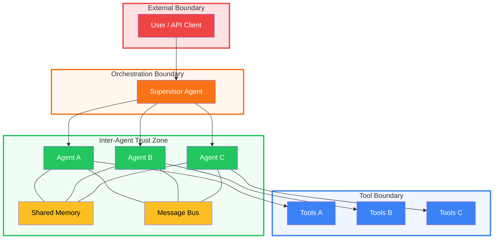
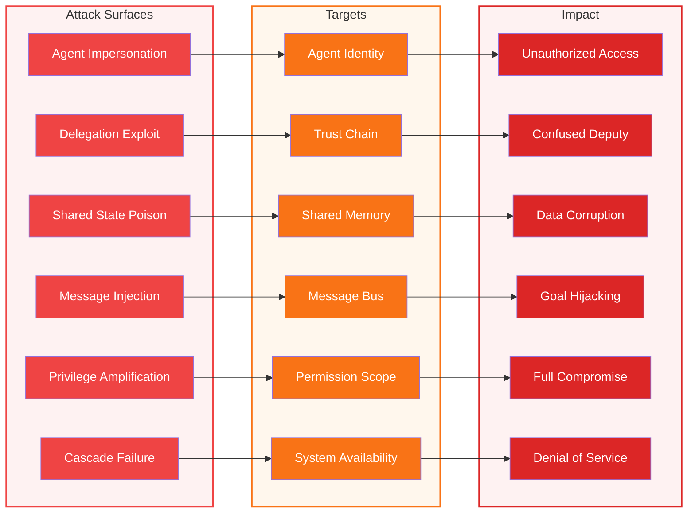
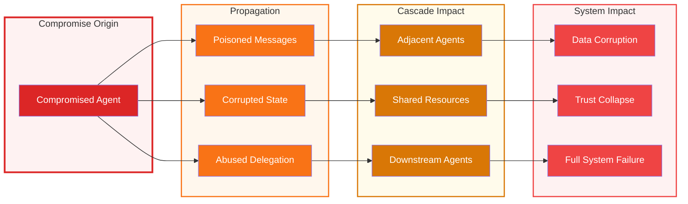

# Multi-Agent Threat Model

When multiple AI agents collaborate, the threat surface expands beyond what any single-agent model captures. New categories of risk emerge from agent-to-agent trust, shared state, delegation chains, and communication channels.

This section extends the [single-agent layered model](/) into the multi-agent domain.

---

## Why Multi-Agent Systems Are Different

A single agent has a clear trust hierarchy: user instructs agent, agent uses tools, tools return results. In a multi-agent system, that hierarchy fractures.

| Property | Single Agent | Multi-Agent |
|----------|-------------|-------------|
| Trust model | Linear (user → agent → tools) | Graph (agents trust each other) |
| Authority | Single principal | Multiple principals, delegation |
| State | Private context window | Shared memory, message buses |
| Failure mode | Isolated | Cascading across agents |
| Attack surface | Tools + user input | Tools + user input + inter-agent channels |
| Auditability | One decision trail | Distributed, multi-hop trails |
| Blast radius | One agent's scope | Entire agent network |

---

## Architecture Patterns

Multi-agent systems follow one of four primary patterns, each with a distinct threat profile. Real-world systems often combine them. See [Architecture Patterns](multi-agent-patterns.md) for full diagrams, per-pattern threat tables, and attack scenarios.

| Pattern | Trust Model | Key Risk | Best For |
|---------|------------|----------|----------|
| **Supervisor** | Centralized — all trust through supervisor | Single point of failure | Task delegation with clear authority |
| **Hierarchical** | Layered — trust attenuates down tree | Deep delegation chains | Complex workflows with sub-teams |
| **Peer Mesh** | Mutual — no central authority | No central enforcement | Collaborative reasoning, debates |
| **Pipeline** | Linear — each stage trusts the previous | Poisoned stage corrupts downstream | Sequential processing, ETL |

---

## Multi-Agent Trust Boundaries

Multi-agent systems introduce new trust boundaries that don't exist in single-agent systems.

### New Trust Boundaries in Multi-Agent Systems

| Boundary | What Crosses It | Key Threats |
|----------|----------------|-------------|
| **Agent ↔ Agent** | Messages, delegated tasks, results | Spoofing, tampering, injection |
| **Agent ↔ Shared State** | Reads/writes to shared memory, DB, files | Poisoning, race conditions, leakage |
| **Agent ↔ Message Bus** | Events, pub/sub messages | Injection, eavesdropping, replay |
| **Delegator ↔ Delegate** | Authority, permissions, context | Confused deputy, privilege amplification |
| **Trust Zone ↔ Trust Zone** | Cross-zone delegations | Boundary violations, scope creep |

---

## Multi-Agent Attack Surface Map

Six new attack surfaces emerge specifically from multi-agent interaction.

---

## Consolidated Threat Catalog

Multi-agent threats span three domains. Each is covered in depth in its own page.

### Communication Threats

| ID | Threat | Severity | Detail Page |
|----|--------|----------|-------------|
| TMA-C1 | Agent impersonation / spoofing | Critical | [Communication](multi-agent-communication.md) |
| TMA-C2 | Message tampering in transit | Critical | [Communication](multi-agent-communication.md) |
| TMA-C3 | Message replay attacks | High | [Communication](multi-agent-communication.md) |
| TMA-C4 | Eavesdropping between agents | High | [Communication](multi-agent-communication.md) |
| TMA-C5 | Message bus injection | Critical | [Communication](multi-agent-communication.md) |
| TMA-C6 | Channel flooding / DoS | High | [Communication](multi-agent-communication.md) |
| TMA-C7 | Deserialization attacks | Critical | [Communication](multi-agent-communication.md) |
| TMA-C8 | Context leakage across boundaries | High | [Communication](multi-agent-communication.md) |
| TMA-C9 | Protocol downgrade attacks | High | [Communication](multi-agent-communication.md) |
| TMA-C10 | Man-in-the-middle between agents | Critical | [Communication](multi-agent-communication.md) |

### Delegation Threats

| ID | Threat | Severity | Detail Page |
|----|--------|----------|-------------|
| TMA-D1 | Confused deputy attack | Critical | [Delegation](multi-agent-delegation.md) |
| TMA-D2 | Privilege amplification | Critical | [Delegation](multi-agent-delegation.md) |
| TMA-D3 | Authority laundering | Critical | [Delegation](multi-agent-delegation.md) |
| TMA-D4 | Delegation chain opacity | High | [Delegation](multi-agent-delegation.md) |
| TMA-D5 | Recursive delegation loop | High | [Delegation](multi-agent-delegation.md) |
| TMA-D6 | Result tampering in responses | High | [Delegation](multi-agent-delegation.md) |
| TMA-D7 | Scope creep in delegation | Medium | [Delegation](multi-agent-delegation.md) |
| TMA-D8 | Revocation failure | High | [Delegation](multi-agent-delegation.md) |
| TMA-D9 | Cross-boundary delegation | Critical | [Delegation](multi-agent-delegation.md) |
| TMA-D10 | Phantom delegation | High | [Delegation](multi-agent-delegation.md) |

### Shared State Threats

| ID | Threat | Severity | Detail Page |
|----|--------|----------|-------------|
| TMA-S1 | Shared memory poisoning | Critical | [Shared State](multi-agent-shared-state.md) |
| TMA-S2 | TOCTOU race conditions | High | [Shared State](multi-agent-shared-state.md) |
| TMA-S3 | Cross-agent data leakage | High | [Shared State](multi-agent-shared-state.md) |
| TMA-S4 | State corruption cascade | Critical | [Shared State](multi-agent-shared-state.md) |
| TMA-S5 | Unauthorized state modification | High | [Shared State](multi-agent-shared-state.md) |
| TMA-S6 | Vector database poisoning | Critical | [Shared State](multi-agent-shared-state.md) |
| TMA-S7 | Configuration tampering | Critical | [Shared State](multi-agent-shared-state.md) |
| TMA-S8 | Stale state exploitation | Medium | [Shared State](multi-agent-shared-state.md) |
| TMA-S9 | State exfiltration | High | [Shared State](multi-agent-shared-state.md) |
| TMA-S10 | Rollback attacks | High | [Shared State](multi-agent-shared-state.md) |

---

## Multi-Agent Control Framework

Controls must address the unique properties of multi-agent interaction. These build on top of the [single-agent controls](/).

```mermaid
flowchart LR
  subgraph IDENTITY["Identity Layer"]
    ID1["Agent Identity"]
    ID2["Mutual Auth"]
    ID3["Credential Rotation"]
  end

  subgraph AUTHZ["Authorization Layer"]
    AZ1["Capability Tokens"]
    AZ2["Scope Attenuation"]
    AZ3["Delegation Limits"]
  end

  subgraph COMMS["Communication Layer"]
    CM1["Message Signing"]
    CM2["Encryption"]
    CM3["Schema Validation"]
  end

  subgraph STATE["State Layer"]
    ST1["Access Control"]
    ST2["Write Validation"]
    ST3["Versioning"]
  end

  subgraph AUDIT["Audit Layer"]
    AU1["Distributed Tracing"]
    AU2["Decision Logging"]
    AU3["Anomaly Detection"]
  end

  IDENTITY --> AUTHZ
  AUTHZ --> COMMS
  COMMS --> STATE
  STATE --> AUDIT

  style IDENTITY fill:#f5f3ff,stroke:#8b5cf6,stroke-width:2px
  style AUTHZ fill:#fffbeb,stroke:#d97706,stroke-width:2px
  style COMMS fill:#f0fdfa,stroke:#0d9488,stroke-width:2px
  style STATE fill:#fdf2f8,stroke:#ec4899,stroke-width:2px
  style AUDIT fill:#eff6ff,stroke:#3b82f6,stroke-width:2px
  style ID1 fill:#8b5cf6,color:#fff
  style ID2 fill:#8b5cf6,color:#fff
  style ID3 fill:#8b5cf6,color:#fff
  style AZ1 fill:#d97706,color:#fff
  style AZ2 fill:#d97706,color:#fff
  style AZ3 fill:#d97706,color:#fff
  style CM1 fill:#0d9488,color:#fff
  style CM2 fill:#0d9488,color:#fff
  style CM3 fill:#0d9488,color:#fff
  style ST1 fill:#ec4899,color:#fff
  style ST2 fill:#ec4899,color:#fff
  style ST3 fill:#ec4899,color:#fff
  style AU1 fill:#3b82f6,color:#fff
  style AU2 fill:#3b82f6,color:#fff
  style AU3 fill:#3b82f6,color:#fff
```

### Controls Summary

| Domain | Control | Purpose |
|--------|---------|---------|
| **Identity** | Unique agent identities | Every agent has a cryptographic identity — no anonymous agents |
| **Identity** | Mutual authentication | Agents verify each other before communication |
| **Identity** | Credential rotation | Agent credentials expire and rotate automatically |
| **Authorization** | Capability tokens | Delegation carries scoped, time-limited capability tokens |
| **Authorization** | Scope attenuation | Each delegation hop reduces permissions, never increases |
| **Authorization** | Delegation depth limits | Hard cap on how many hops a delegation chain can traverse |
| **Communication** | Message signing | All inter-agent messages are cryptographically signed |
| **Communication** | Encryption | Messages encrypted in transit and at rest |
| **Communication** | Schema validation | Message payloads validated against strict schemas |
| **State** | Per-agent access control | Each agent has explicit read/write scopes on shared state |
| **State** | Write validation | Writes to shared state validated for integrity and authorization |
| **State** | Versioning | All shared state changes versioned with rollback capability |
| **Audit** | Distributed tracing | Every multi-agent interaction traced end-to-end |
| **Audit** | Decision logging | Why each routing/delegation decision was made |
| **Audit** | Anomaly detection | Behavioral baselines with alerts on deviation |

---

## Cascade Failure Model

In multi-agent systems, a compromise in one agent can cascade through the network. The blast radius depends on the architecture pattern.

See the [pattern comparison matrix](multi-agent-patterns.md) for a full blast radius analysis by architecture type.

---

## Deep Dive Pages

  <a href="#/multi-agent-communication" style="background:#0d9488">Communication Threats</a>
  <a href="#/multi-agent-delegation" style="background:#d97706">Delegation Chains</a>
  <a href="#/multi-agent-shared-state" style="background:#ec4899">Shared State</a>
  <a href="#/multi-agent-patterns" style="background:#6366f1">Architecture Patterns</a>

