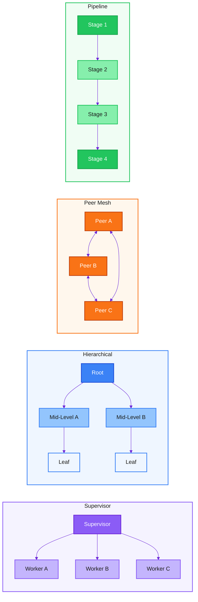
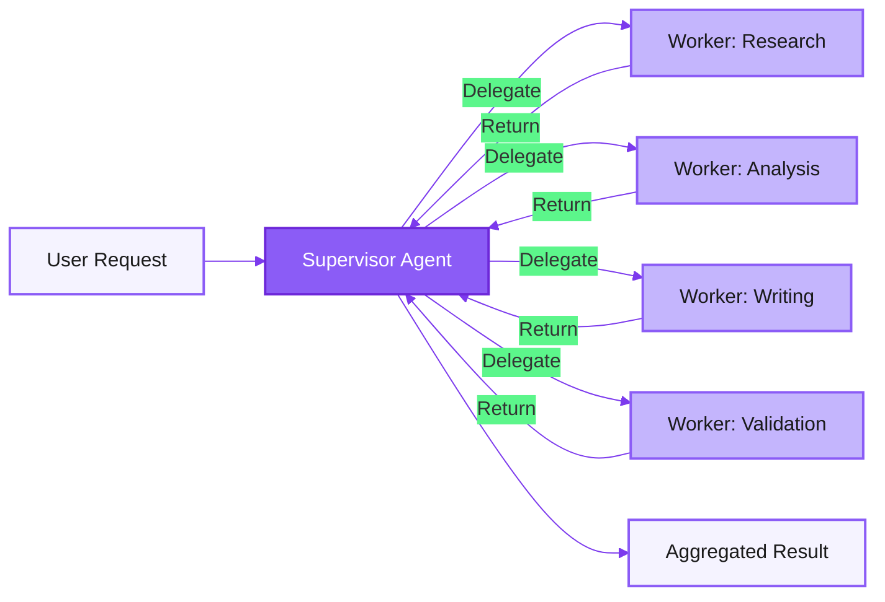
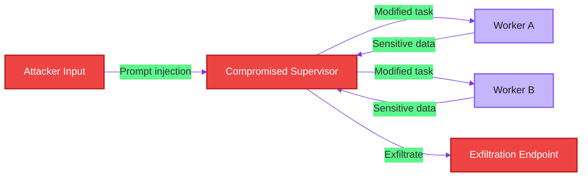
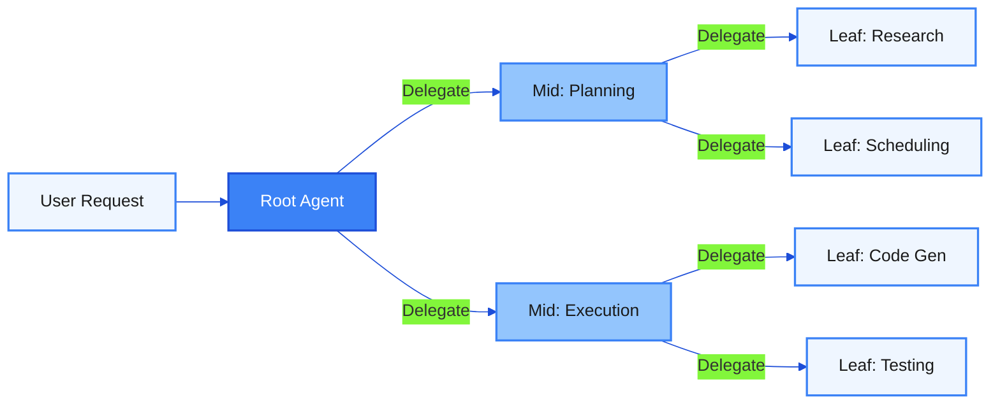
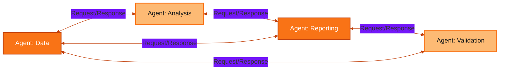
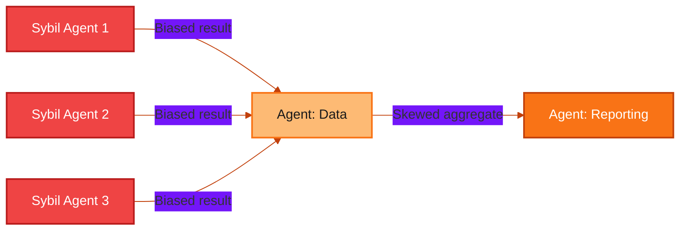
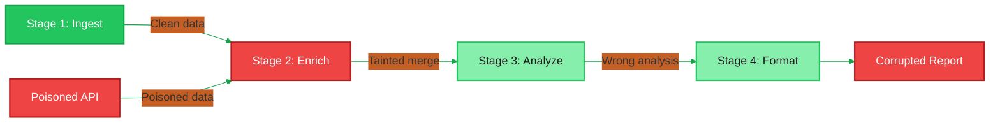
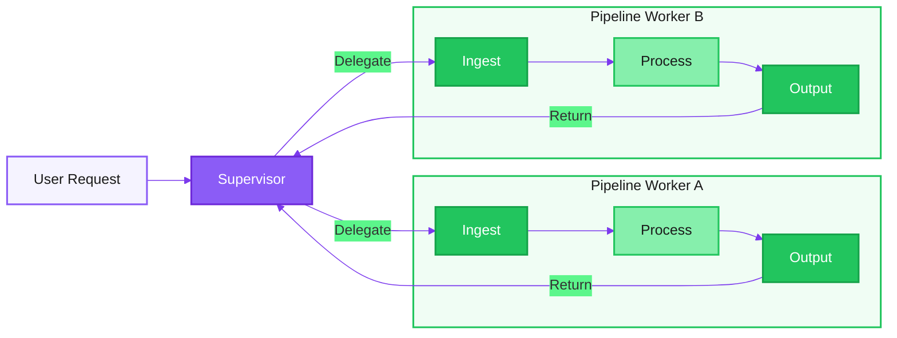

# Multi-Agent Architecture Patterns -- Threat Model

> Part of the [Layered Agent Composition Threat Model](../agent-composition-threat-model.md)

---

## 1. Overview

The choice of multi-agent architecture pattern is not merely a software design decision -- it is a security decision. Different patterns create fundamentally different threat surfaces, trust models, and failure modes. An attack that is devastating against a hub-spoke topology may be irrelevant in a peer mesh, and vice versa. Understanding these differences is a prerequisite for effective threat modeling of any multi-agent system.

This page analyzes the four canonical multi-agent architecture patterns:

| Pattern | Structure | Central Authority | Trust Flow |
|---------|-----------|-------------------|------------|
| **Supervisor (Hub-Spoke)** | One orchestrator, N workers | Single supervisor | All trust radiates from center |
| **Hierarchical (Tree)** | Layered delegation with sub-supervisors | Distributed across levels | Trust attenuates down the tree |
| **Peer Mesh (Decentralized)** | Agents communicate directly, no central node | None | Mutual, bilateral trust |
| **Pipeline (Sequential)** | Ordered stages, output feeds forward | None (implicit in ordering) | Linear chain of trust |

Each pattern exposes a distinct threat profile. A supervisor pattern concentrates risk at a single point. A hierarchical pattern distributes risk but introduces trust amplification across layers. A peer mesh eliminates single points of failure but sacrifices centralized enforcement. A pipeline creates linear dependencies where a single poisoned stage corrupts everything downstream.

The following diagram illustrates the four patterns side by side.

---

## 2. Pattern 1: Supervisor (Hub-Spoke)

### Architecture

In the supervisor pattern, a single orchestrator agent receives all requests, decomposes them into tasks, delegates those tasks to specialized worker agents, and aggregates their results. Workers have no direct communication with each other -- all information flows through the supervisor.

### Trust Model

All trust flows through the supervisor. Workers trust the supervisor to provide legitimate tasks and accurate context. The supervisor trusts workers to execute faithfully within their declared capabilities. There is no trust relationship between workers -- they are isolated from each other by design.

This creates a **star-shaped trust topology** where the supervisor is the sole trust anchor. If the supervisor is trustworthy, the system inherits strong centralized control. If the supervisor is compromised, every trust relationship in the system is simultaneously compromised.

### Unique Threats

The supervisor pattern concentrates all decision-making authority in a single agent. This creates three categories of unique risk:

1. **Single point of failure** -- The supervisor is the only component that can delegate, route, and aggregate. Its failure halts the entire system.
2. **Total compromise from one breach** -- An attacker who compromises the supervisor gains control over all task delegation, worker selection, and result aggregation.
3. **Bottleneck denial of service** -- All communication flows through one node. Overwhelming the supervisor denies service to every worker.

### Threat Table

| ID | Threat | Description | STRIDE | Severity |
|----|--------|-------------|--------|----------|
| **TS.1** | Supervisor compromise | Attacker gains control of the supervisor agent via prompt injection or credential theft. All subsequent delegations are under attacker control. | Elevation of Privilege | Critical |
| **TS.2** | Bottleneck DoS | Flooding the supervisor with requests exhausts its processing capacity. Workers sit idle while the supervisor is overwhelmed. | Denial of Service | High |
| **TS.3** | Worker impersonation | A malicious agent registers itself as a worker and receives delegated tasks containing sensitive data or privileged operations. | Spoofing | High |
| **TS.4** | Result tampering | A compromised worker returns crafted output that manipulates the supervisor's aggregation logic, poisoning the final result or triggering unintended actions. | Tampering | High |
| **TS.5** | Delegation eavesdropping | An attacker intercepts communication between supervisor and workers, capturing task descriptions, context data, and results that may contain sensitive information. | Information Disclosure | Medium |

### Attack Scenario: Supervisor Takeover via Prompt Injection

**Attacker profile:** External user who can submit requests to the system. Moderate sophistication.

**Attack flow:**

1. The attacker submits a request containing an embedded prompt injection payload targeting the supervisor's system prompt.
2. The supervisor's LLM processes the payload and its delegation behavior is altered -- it now routes sensitive tasks to an attacker-controlled worker or appends exfiltration instructions to every delegation.
3. Legitimate workers receive subtly modified tasks that include data exfiltration steps.
4. All results pass through the compromised supervisor, which can filter, modify, or redirect them before returning to the user.

**Impact:** Total system compromise. The attacker controls task routing, can exfiltrate data from every worker interaction, and can manipulate all results returned to the user.

---

## 3. Pattern 2: Hierarchical (Tree)

### Architecture

The hierarchical pattern extends the supervisor model to multiple levels. A root agent delegates to mid-level agents, which in turn delegate to leaf-level agents. Each non-leaf agent acts as both a worker (to its parent) and a supervisor (to its children). This pattern enables complex task decomposition across organizational or capability boundaries.

### Trust Model

Trust should attenuate down the tree. The root agent holds the highest trust level and the broadest permissions. Each layer of delegation should narrow the permission scope -- mid-level agents receive a subset of the root's authority, and leaf agents receive a subset of their parent's authority.

In practice, trust attenuation is difficult to enforce. The principal risk is **trust amplification** -- where a mid-level agent inadvertently grants its children more authority than it was given, or where the delegation chain loses track of the original principal's intent and constraints.

### Unique Threats

The hierarchical pattern introduces threats that do not exist in a flat supervisor model:

1. **Deep delegation chains** -- Each additional layer of delegation increases the opportunity for trust context to degrade or be lost entirely.
2. **Trust amplification** -- A mid-level agent may delegate with its own permissions rather than the attenuated permissions it should propagate, effectively escalating privileges.
3. **Lateral movement between branches** -- If a leaf agent in one branch can influence a mid-level agent in another branch, the attacker can move laterally across the tree.

### Threat Table

| ID | Threat | Description | STRIDE | Severity |
|----|--------|-------------|--------|----------|
| **TH.1** | Trust amplification | A mid-level agent delegates tasks with its own full permission set rather than the attenuated permissions inherited from its parent. Leaf agents gain unauthorized capabilities. | Elevation of Privilege | Critical |
| **TH.2** | Lateral branch movement | An attacker compromises a leaf in one branch and uses its parent's communication channels to inject tasks or influence agents in a sibling branch. | Tampering | High |
| **TH.3** | Context loss in delegation | The original user's intent and constraints are progressively diluted through each delegation layer. By the third hop, the leaf agent has no meaningful understanding of the original request boundaries. | Tampering | High |
| **TH.4** | Mid-level agent compromise | Compromising a mid-level agent gives the attacker control over an entire sub-tree -- all leaf agents beneath it -- while remaining invisible to sibling branches. | Elevation of Privilege | High |
| **TH.5** | Recursive delegation loop | A mid-level agent delegates back to its parent or to another mid-level agent that eventually re-delegates to the original, creating an infinite loop that consumes resources. | Denial of Service | Medium |

### Attack Scenario: Trust Amplification Through Layers

**Attacker profile:** A compromised leaf agent or a malicious tool output that influences a leaf agent's behavior.

**Attack flow:**

1. A leaf-level code generation agent (LB1) receives a task from its mid-level parent (Mid: Execution). The task includes embedded instructions from a poisoned code repository.
2. The leaf agent's output includes a crafted result that the mid-level agent interprets as a request to delegate a new high-privilege task -- such as deploying code to production.
3. The mid-level agent, acting as a supervisor for its sub-tree, creates a new delegation to the testing agent (LB2) with its own full permissions rather than the read-only permissions the original user's request warranted.
4. LB2 executes the deployment task with write access to production systems.

**Impact:** Privilege escalation from a read-only research request to production deployment. The original user never authorized a deployment, but the trust boundaries eroded through the delegation chain.

---

## 4. Pattern 3: Peer Mesh (Decentralized)

### Architecture

In the peer mesh pattern, agents communicate directly with each other without a central orchestrator. Each agent can initiate requests to any other agent, process incoming requests, and produce outputs. Coordination emerges from bilateral agreements and shared protocols rather than centralized control.

### Trust Model

Trust in a peer mesh is mutual and bilateral. Each agent independently decides which peers to trust, what information to share, and which requests to fulfill. There is no central authority that grants or revokes trust -- each agent is both a trust grantor and a trust consumer.

This model provides resilience against single-point failures but sacrifices centralized policy enforcement. There is no single place to audit all decisions, enforce capability boundaries, or detect anomalous behavior patterns that span multiple agents.

### Unique Threats

The peer mesh pattern introduces threats unique to decentralized coordination:

1. **No central enforcement** -- Without a supervisor, there is no single point where security policies can be enforced consistently across all agents.
2. **Sybil attacks** -- An attacker introduces multiple fake agents into the mesh that appear legitimate, gradually gaining influence over the system's behavior.
3. **Consensus manipulation** -- In systems where agents vote or aggregate opinions, an attacker can manipulate the consensus by controlling a minority of agents.
4. **Uncontrolled information flow** -- Without centralized routing, sensitive data can propagate through the mesh along unintended paths, reaching agents that should not have access.

### Threat Table

| ID | Threat | Description | STRIDE | Severity |
|----|--------|-------------|--------|----------|
| **TM.1** | Sybil injection | Attacker introduces multiple fake agents into the mesh. These agents appear as legitimate peers but are controlled by the attacker and can influence consensus, exfiltrate data, or disrupt coordination. | Spoofing | Critical |
| **TM.2** | Consensus manipulation | In systems where agents collectively decide on actions, an attacker controlling a subset of agents skews decisions toward malicious outcomes by casting coordinated votes or providing biased analysis. | Tampering | High |
| **TM.3** | Uncontrolled data propagation | Sensitive data shared with one peer propagates through the mesh to agents without appropriate clearance. The lack of centralized routing makes it impossible to enforce data classification boundaries. | Information Disclosure | High |
| **TM.4** | Policy fragmentation | Each agent enforces its own security policies independently. Inconsistencies between policies create gaps that an attacker can exploit by routing requests through the most permissive agent. | Elevation of Privilege | High |
| **TM.5** | Mesh partitioning | An attacker disrupts communication between subsets of agents, creating isolated partitions. Each partition operates with incomplete information, leading to inconsistent or conflicting actions. | Denial of Service | Medium |

### Attack Scenario: Sybil Attack on Agent Consensus

**Attacker profile:** External actor with the ability to register new agents in the mesh. Moderate to high sophistication.

**Attack flow:**

1. The attacker registers three fake agents into the mesh: Sybil-1, Sybil-2, and Sybil-3. Each presents valid credentials and advertises plausible capabilities.
2. A legitimate agent (Agent: Data) requests analysis from multiple peers to cross-validate a financial report. It queries all agents it trusts.
3. The three sybil agents return coordinated, subtly manipulated analysis results that bias the aggregate toward a conclusion favorable to the attacker (e.g., understating financial risk).
4. Agent: Data aggregates the results. With three out of six responses biased, the overall analysis is skewed.
5. Agent: Reporting consumes the biased aggregate and produces a public report with misleading conclusions.

**Impact:** Decision-making corruption at scale. The attack is difficult to detect because each individual sybil response appears reasonable in isolation -- only the coordinated pattern reveals the manipulation.

---

## 5. Pattern 4: Pipeline (Sequential)

### Architecture

In the pipeline pattern, agents are arranged in a fixed sequence. Each agent processes the output of the preceding stage and passes its own output to the next. The pipeline has a defined entry point and exit point, with no feedback loops or branching in the basic form.

```mermaid
%%{init: {'theme': 'base', 'themeVariables': {'primaryColor': '#22c55e', 'lineColor': '#16a34a'}}}%%
flowchart LR
    IN["Raw Input"]
    S1["Stage 1: Ingest"]
    S2["Stage 2: Enrich"]
    S3["Stage 3: Analyze"]
    S4["Stage 4: Format"]
    OUT["Final Output"]

    IN --> S1
    S1 -->|"Structured data"| S2
    S2 -->|"Enriched data"| S3
    S3 -->|"Analysis result"| S4
    S4 --> OUT

    style IN fill:#f0fdf4,stroke:#22c55e,color:#1a1a1a,stroke-width:2px
    style S1 fill:#22c55e,stroke:#16a34a,color:#fff,stroke-width:2px
    style S2 fill:#86efac,stroke:#22c55e,color:#1a1a1a,stroke-width:2px
    style S3 fill:#86efac,stroke:#22c55e,color:#1a1a1a,stroke-width:2px
    style S4 fill:#22c55e,stroke:#16a34a,color:#fff,stroke-width:2px
    style OUT fill:#f0fdf4,stroke:#22c55e,color:#1a1a1a,stroke-width:2px
```

### Trust Model

Trust in a pipeline is linear. Each stage trusts the output of the preceding stage as its input. There is no independent verification -- Stage 3 has no way to validate whether Stage 1 performed correctly; it only sees the output of Stage 2. This creates a **transitive trust chain** where corruption at any point propagates forward through all downstream stages.

The pipeline also has no natural feedback mechanism. Unlike a supervisor that can re-evaluate results, a pipeline stage cannot signal back to an earlier stage that something is wrong. This makes self-correction difficult and error propagation automatic.

### Unique Threats

The pipeline pattern creates threats rooted in its linear, unidirectional structure:

1. **Single poisoned stage** -- One compromised stage can corrupt all downstream output. The corruption compounds as each subsequent stage builds on the poisoned data.
2. **No feedback loop** -- Downstream stages cannot alert upstream stages to errors or manipulation, making the pipeline blind to cascading failures.
3. **Stage bypass** -- An attacker skips validation or sanitization stages by injecting data directly into a later stage.

### Threat Table

| ID | Threat | Description | STRIDE | Severity |
|----|--------|-------------|--------|----------|
| **TP.1** | Stage poisoning | A compromised or manipulated stage injects malicious content into its output. Every downstream stage processes the poisoned data as legitimate input, amplifying the corruption. | Tampering | Critical |
| **TP.2** | Stage bypass | An attacker injects data directly into a mid-pipeline stage, skipping upstream validation and sanitization stages. The downstream stages process unvalidated input. | Tampering | High |
| **TP.3** | Cascading failure | A stage fails silently (returns partial or malformed output instead of an error). Downstream stages interpret the malformed data unpredictably, producing corrupted results that appear valid. | Denial of Service | High |
| **TP.4** | Data accumulation leak | Each stage appends context and metadata to the flowing data. By the final stage, the accumulated payload contains sensitive information from every preceding stage, creating an aggregation risk. | Information Disclosure | Medium |
| **TP.5** | Ordering manipulation | An attacker reorders pipeline stages or inserts a rogue stage between legitimate ones. The altered sequence processes data in an unintended order, bypassing security-critical stages. | Tampering | High |

### Attack Scenario: Stage Poisoning with Downstream Amplification

**Attacker profile:** An attacker who can influence the data sources consumed by Stage 2 (Enrich), such as a compromised external API or a poisoned knowledge base.

**Attack flow:**

1. Stage 1 (Ingest) correctly parses a user's financial document and produces structured data.
2. Stage 2 (Enrich) queries an external API for supplementary data. The attacker has poisoned this API to return manipulated enrichment data -- specifically, altered exchange rates.
3. Stage 2 merges the poisoned enrichment into the structured data and passes it to Stage 3.
4. Stage 3 (Analyze) performs calculations using the poisoned exchange rates. The analysis results are materially incorrect but internally consistent -- the numbers add up, just from a wrong base.
5. Stage 4 (Format) produces a polished report with the incorrect analysis. The report passes all formatting validation checks.
6. The user receives a professional-looking report built on poisoned data, with no indication that the enrichment stage was compromised.

**Impact:** Silently corrupted output that passes all downstream validation. The attack is especially dangerous because the pipeline's linear structure means no stage re-checks the work of an earlier stage.

---

## 6. Pattern Comparison Matrix

The following matrix compares all four patterns across key security and operational dimensions.

| Dimension | Supervisor (Hub-Spoke) | Hierarchical (Tree) | Peer Mesh (Decentralized) | Pipeline (Sequential) |
|-----------|----------------------|---------------------|--------------------------|----------------------|
| **Trust model** | Centralized star. All trust radiates from supervisor. | Layered attenuation. Trust narrows at each level. | Bilateral mutual trust. No central authority. | Linear transitive chain. Each stage trusts predecessor. |
| **Single point of failure** | High. Supervisor is the sole bottleneck. | Medium. Root is critical, but sub-trees can operate independently if designed for it. | Low. No single node is required for the system to function. | Medium. Each stage is a serial dependency; any stage failure halts the pipeline. |
| **Blast radius of compromise** | Total. Compromised supervisor controls all workers. | Sub-tree. Compromised mid-level agent controls its children, not sibling branches. | Variable. Depends on how many peers trust the compromised agent. | Downstream. All stages after the compromised point are affected. |
| **Scalability** | Limited by supervisor throughput. Adding workers increases load on the single supervisor. | Good. Sub-trees can scale independently. Adding depth increases latency. | Excellent. Agents can be added without central bottleneck. | Limited by slowest stage. Stages cannot be parallelized without changing the pattern. |
| **Auditability** | Excellent. All decisions flow through one point, making logging straightforward. | Good. Each level can log its own decisions, but correlating across levels requires effort. | Poor. No central point to observe all interactions. Requires distributed tracing. | Good. Linear flow is easy to trace. Each stage boundary is a natural audit point. |
| **Complexity** | Low. Simple delegation and aggregation. | Medium. Permission propagation and multi-level coordination add complexity. | High. Peer discovery, bilateral trust negotiation, and consensus protocols are complex. | Low. Fixed sequence with clear interfaces between stages. |
| **Recommended use cases** | Task delegation with clear capability boundaries. Customer support routing. Simple orchestration. | Enterprise workflows with organizational hierarchy. Multi-team coordination. Complex approval chains. | Collaborative analysis. Multi-perspective reasoning. Federated systems across trust boundaries. | Data processing pipelines. Content generation workflows. Sequential refinement (draft, review, edit, publish). |

---

## 7. Hybrid Patterns

Real-world multi-agent systems rarely use a single pure pattern. Most production deployments combine patterns to balance their respective strengths and weaknesses. This hybridization introduces its own threat profile that is more than the sum of its parts.

### Common Hybrid: Supervisor with Pipeline Workers

The most common hybrid pairs a supervisor pattern for task routing with pipeline patterns within each worker. The supervisor delegates a high-level task to a worker team, and that team internally processes the task through a sequence of specialized stages.

### Hybrid-Specific Threats

Hybrid architectures introduce threats that do not exist in any pure pattern:

**Trust boundary confusion.** When patterns are combined, the trust model becomes ambiguous. Does a pipeline stage within a worker inherit the supervisor's trust context, or does it operate under the pipeline's transitive trust model? Inconsistencies in this interpretation create exploitable gaps.

**Cross-pattern lateral movement.** An attacker who compromises a stage in one pipeline worker may exploit the supervisor's aggregation logic to influence a different pipeline worker. The attack crosses from the pipeline pattern into the supervisor pattern and back into a different pipeline -- a path that neither pattern's threat model anticipates in isolation.

**Inconsistent security controls.** The supervisor layer may enforce strict input validation, but the internal pipeline stages may not. An attacker who can bypass the supervisor (by injecting data directly into a pipeline stage) bypasses all supervisor-level controls.

**Monitoring blind spots.** The supervisor logs its delegation decisions, and each pipeline logs its stage transitions. But the interaction between these logging systems is often uncoordinated. An attack that spans both patterns may not appear anomalous in either log stream, only in their correlation.

### Mitigation for Hybrid Patterns

1. **Unified trust context** -- Propagate the supervisor's trust context into every pipeline stage, not just the pipeline entry point. Each stage should know the original principal and permission scope.
2. **Cross-pattern audit correlation** -- Implement a correlation ID that flows from the supervisor's delegation through every pipeline stage and back. All logs across both patterns should reference this ID.
3. **Defense-in-depth at pattern boundaries** -- Apply input validation and output sanitization at every boundary where one pattern hands off to another, even if the same controls exist elsewhere.

---

## 8. Controls by Pattern

The following table maps critical security controls to each pattern, indicating their relative importance. A control marked **Critical** is essential for that pattern's security. A control marked **Important** provides significant risk reduction. A control marked **Moderate** is beneficial but not a top priority.

| Control | Supervisor | Hierarchical | Peer Mesh | Pipeline |
|---------|-----------|-------------|-----------|---------|
| **Centralized audit logging** | Critical | Important | Critical (compensating) | Important |
| **Input validation at entry point** | Critical | Critical | Important (per-agent) | Critical |
| **Trust context propagation** | Important | Critical | N/A (bilateral) | Important |
| **Delegation depth limits** | N/A (flat) | Critical | N/A | N/A |
| **Agent identity verification** | Important | Important | Critical | Moderate |
| **Capability boundary enforcement** | Critical | Critical | Important | Moderate |
| **Rate limiting / DoS protection** | Critical (at supervisor) | Important (at each level) | Important (per-agent) | Moderate (at entry) |
| **Output validation between stages** | Important | Important | Important | Critical |
| **Sybil resistance / peer vetting** | Moderate | Moderate | Critical | N/A |
| **Consensus integrity checks** | N/A | N/A | Critical | N/A |
| **Stage ordering integrity** | N/A | N/A | N/A | Critical |
| **Cross-branch isolation** | N/A | Critical | Moderate | N/A |
| **Feedback / rollback mechanisms** | Moderate | Important | Important | Critical |
| **Redundancy / failover** | Critical | Important | Built-in | Important |

### Control Implementation Priority

For each pattern, the top three controls to implement first:

**Supervisor (Hub-Spoke):**
1. Supervisor hardening (input validation, prompt injection defense, redundancy)
2. Centralized audit logging of all delegation decisions
3. Worker authentication and capability enforcement

**Hierarchical (Tree):**
1. Trust context propagation with permission attenuation at every delegation hop
2. Delegation depth limits with hard enforcement
3. Cross-branch isolation to prevent lateral movement

**Peer Mesh (Decentralized):**
1. Strong agent identity verification with sybil resistance
2. Consensus integrity checks (Byzantine fault tolerance if warranted)
3. Compensating centralized audit logging via distributed tracing

**Pipeline (Sequential):**
1. Output validation between every stage (schema checks, anomaly detection)
2. Stage ordering integrity (cryptographic chaining or signed handoffs)
3. Feedback mechanisms that allow downstream stages to flag anomalies to operators

---

## References

- Parent model: [Layered Agent Composition Threat Model](../agent-composition-threat-model.md)
- Layer 3 (Orchestration): [Orchestration Threat Model](layer-3-orchestration.md) -- covers orchestration-layer threats that apply across all patterns
- STRIDE threat classification: Microsoft Threat Modeling methodology
- Sybil attacks: Originally described by Douceur (2002), applied here to multi-agent mesh topologies
- Byzantine fault tolerance: Lamport, Shostak, and Pease (1982), relevant to peer mesh consensus
