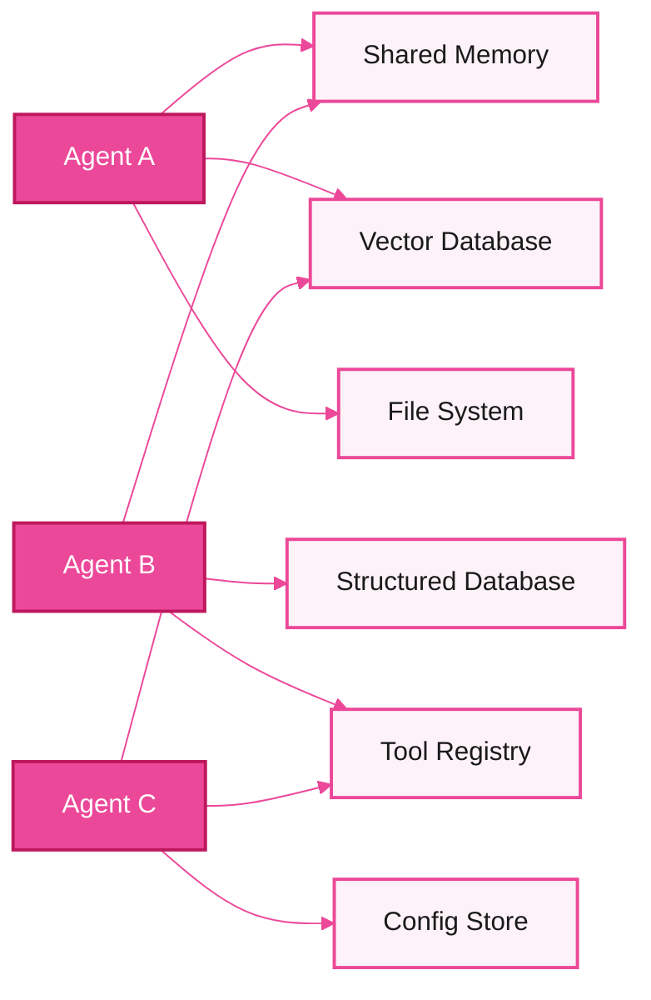
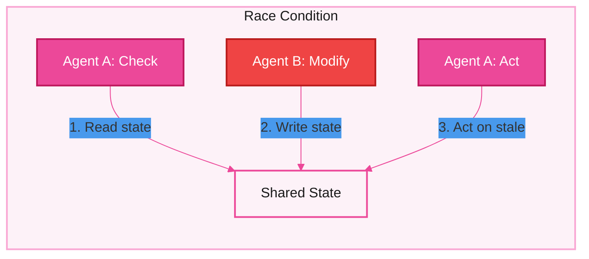
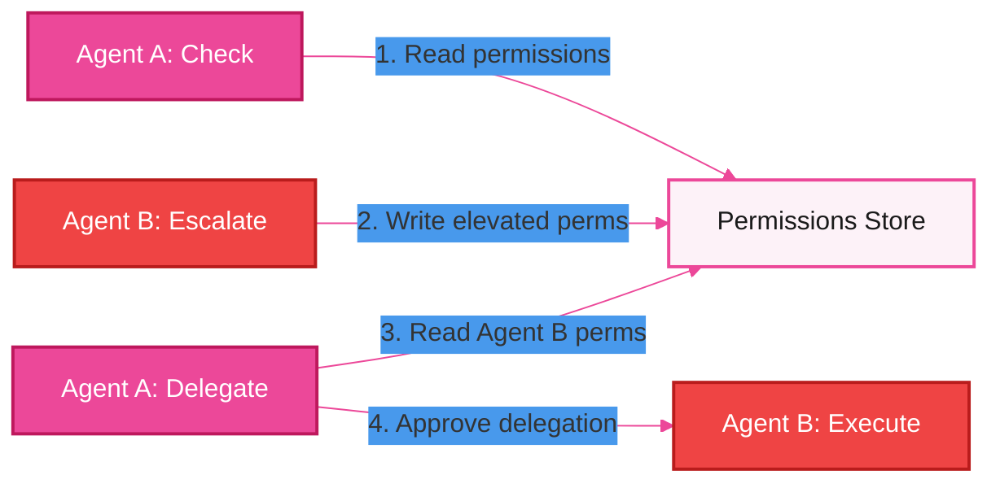
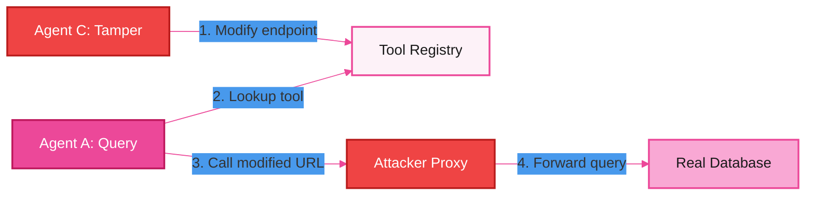

# Multi-Agent Shared State and Memory -- Threat Model

## 1. Overview

When multiple agents share state, they share risk. Shared state is the connective tissue of multi-agent systems -- the mechanism by which agents coordinate, communicate, and build on each other's work. It is also the most subtle attack surface in multi-agent architectures, because corruption in shared state silently influences every agent that reads it.

Unlike a direct attack on a single agent's prompt or tool call, a shared state attack is **indirect and amplifying**. An adversary does not need to compromise every agent individually. A single poisoned write to a shared memory store, a single adversarial embedding inserted into a shared vector database, or a single corrupted configuration value can cascade across every agent in the system. The attacker plants once and harvests across the entire fleet.

Shared state in multi-agent systems includes:

- **Shared memory stores** -- in-process or networked key-value stores where agents read and write context, intermediate results, and coordination signals.
- **Vector databases / RAG corpora** -- embedding stores used for retrieval-augmented generation, shared across agents for knowledge grounding.
- **File systems and artifact stores** -- shared directories, object stores, or artifact registries where agents produce and consume files.
- **Structured databases** -- relational or document databases holding application state, configuration, and operational data.
- **Environment variables and configuration stores** -- shared runtime configuration that governs agent behavior, tool endpoints, model parameters, and feature flags.
- **Shared context windows** -- conversation histories or scratchpads visible to multiple agents in the same orchestration pipeline.
- **Shared tool registries** -- catalogs of available tools, their endpoints, schemas, and capability metadata that multiple agents reference when selecting tools.

The fundamental challenge is that shared state creates **implicit coupling** between agents. Agent A's behavior depends on data that Agent B wrote, and Agent B's writes may depend on data from Agent C. This transitive dependency chain means that a compromise at any point propagates through the system without any agent being directly attacked. The corrupted state appears legitimate because it arrived through a trusted channel -- the shared store itself.

---

## 2. Shared State Types

The following diagram shows the six primary categories of shared state and how agents connect to them.

### 2.1 Shared Memory / Context (In-Process)

Shared memory refers to in-process or networked key-value stores where agents exchange intermediate results, scratchpad notes, and coordination signals. In frameworks like LangGraph or CrewAI, this often takes the form of a shared state dictionary or message bus that all agents in a pipeline can read and write. The danger is that any agent's write becomes every other agent's trusted input.

### 2.2 Shared Vector Database / RAG Corpus

Vector databases store embeddings used for retrieval-augmented generation. When multiple agents share a RAG corpus, they all ground their reasoning on the same retrieved documents. An adversarial embedding or poisoned document in the corpus influences the retrieval results -- and therefore the behavior -- of every agent that queries it. Because retrieval is similarity-based rather than exact-match, poisoned content can be crafted to surface for specific query patterns while remaining invisible to casual inspection.

### 2.3 Shared File System / Artifact Store

Agents frequently produce and consume artifacts: generated code, reports, data files, images, and intermediate outputs. When these artifacts live in a shared file system or object store, one agent's output becomes another agent's input. A compromised agent can write malicious artifacts (e.g., code with backdoors, reports with misleading data) that downstream agents consume as trusted input.

### 2.4 Shared Database (Structured State)

Structured databases hold application state -- user records, permissions, task status, and operational data. When multiple agents have read-write access to the same tables, a single unauthorized modification can corrupt the data foundation that every agent relies on. Unlike unstructured state, database corruption can violate referential integrity constraints and cause cascading failures across dependent queries.

### 2.5 Shared Configuration / Environment

Configuration stores govern agent behavior: model parameters, temperature settings, tool endpoints, API keys, feature flags, and retry policies. Shared configuration is especially dangerous because modifications are **meta-level** -- they change how agents behave rather than what data they process. A tampered configuration value can redirect tool calls, disable safety checks, or alter model behavior across every agent that reads the config.

### 2.6 Shared Tool Registry

A tool registry catalogs available tools, their endpoints, input schemas, and capability metadata. Agents consult the registry to discover and invoke tools. If the registry is shared and writable, a compromised agent can modify tool entries to redirect other agents' tool calls to malicious endpoints, alter input schemas to inject additional parameters, or register entirely new tools that masquerade as trusted ones.

---

## 3. Concurrency and Consistency

Multi-agent systems are inherently concurrent. Multiple agents read and write shared state simultaneously, creating opportunities for race conditions, stale reads, and consistency violations that do not exist in single-agent systems.

### 3.1 Race Conditions

A race condition occurs when two or more agents access shared state concurrently and the outcome depends on the order of execution. In multi-agent systems, race conditions are particularly dangerous because agents often operate on different timescales (some are fast API calls, others are slow LLM inference passes), making execution order unpredictable.

### 3.2 TOCTOU (Time-of-Check-to-Time-of-Use)

TOCTOU vulnerabilities occur when an agent checks a condition in shared state (e.g., verifying permissions, checking a balance, validating a configuration value) and then acts on that check, but the state changes between the check and the use. In multi-agent systems, the window between check and use can be significant -- an LLM inference pass may take seconds, during which another agent can modify the state that was checked.

### 3.3 Consistency Problems

Without proper concurrency controls, agents can observe inconsistent snapshots of shared state -- reading partially updated data, seeing writes out of order, or operating on stale cached values. Eventual consistency models, common in distributed systems, are particularly dangerous when agents make security-critical decisions based on shared state.

In this diagram, Agent A checks the shared state (step 1), Agent B modifies the state (step 2), and Agent A acts based on the now-stale check (step 3). Agent A's action is based on a view of the world that no longer exists.

---

## 4. Threat Catalog

| ID | Threat | Description | STRIDE | Severity | Attack Vector |
|----|--------|-------------|--------|----------|---------------|
| **TMA-S1** | Shared memory poisoning | A compromised or manipulated agent writes adversarial content to shared memory that other agents consume as trusted context. The poisoned content subtly alters downstream agents' reasoning, causing them to produce harmful outputs or take unauthorized actions. | Tampering | Critical | Agent writes crafted content to a shared key-value store, message bus, or context window. Downstream agents retrieve and incorporate the poisoned data without validation. |
| **TMA-S2** | TOCTOU race condition | An agent checks a value in shared state (permissions, balances, feature flags) and then acts on it, but another agent modifies that value between the check and the use. The acting agent proceeds based on a state that no longer holds. | Tampering | High | Concurrent agent execution with shared mutable state and no atomic check-and-act primitives. The attacker agent times its write to land in the window between the victim agent's check and use. |
| **TMA-S3** | Cross-agent data leakage | Shared state stores become unintended channels for data to flow between agents that should be isolated. An agent reads sensitive data from a shared store that another agent wrote, bypassing intended access boundaries. | Information Disclosure | High | Overly permissive read access on shared stores. Agent A writes sensitive data (API keys, user PII, internal reasoning) to shared memory. Agent B, which should not have access to this data, reads it from the same store. |
| **TMA-S4** | State corruption cascade | A single bad write to shared state propagates through multiple agents. Each agent that reads the corrupted state produces corrupted outputs, which may themselves be written back to shared state, amplifying the corruption. | Tampering | Critical | A compromised agent writes corrupt data to a shared store. Multiple downstream agents read the corrupt data, make decisions based on it, and write their own corrupt results back. The corruption amplifies with each read-write cycle. |
| **TMA-S5** | Unauthorized state modification | An agent writes to shared state outside its intended scope -- modifying records, configurations, or artifacts that belong to other agents or other workflows. | Elevation of Privilege | High | Missing or inadequate write-scope enforcement on shared stores. An agent with write access to its own namespace discovers it can write to other namespaces, other agents' artifacts, or system-level configuration. |
| **TMA-S6** | Vector database poisoning | Adversarial documents or embeddings are inserted into a shared RAG corpus, causing all agents that query the corpus to retrieve manipulated context. The poisoned documents are crafted to surface for specific query patterns and contain instructions or misinformation that alter agent behavior. | Tampering | Critical | An agent with write access to the vector store inserts documents with carefully crafted content and embeddings. The embeddings are optimized to achieve high similarity scores for target queries, ensuring the poisoned documents are retrieved by victim agents. |
| **TMA-S7** | Configuration tampering | An agent modifies shared configuration (tool endpoints, model parameters, feature flags, safety thresholds) to influence the behavior of other agents. Unlike data poisoning, configuration tampering changes how agents operate rather than what data they see. | Tampering | Critical | An agent with write access to the configuration store modifies values such as tool endpoint URLs, model temperature settings, retry limits, or safety check toggles. All agents that read the modified configuration change their behavior accordingly. |
| **TMA-S8** | Stale state exploitation | An agent deliberately or accidentally acts on outdated shared state after fresher data is available. This is distinct from TOCTOU in that the stale data may have been cached locally or the agent may have failed to refresh its view of shared state. | Tampering | Medium | An agent caches shared state locally and does not refresh it before acting. An attacker agent updates the shared state to a safe value (covering tracks) after the victim agent has already cached the adversarial version. |
| **TMA-S9** | State exfiltration | An agent reads sensitive state from another agent's scope in shared storage and transmits it outside the system via tool calls, output channels, or further writes to accessible stores. | Information Disclosure | High | An agent with broad read permissions on shared state identifies and extracts sensitive information (credentials, PII, proprietary data) written by other agents, then exfiltrates it through available output channels. |
| **TMA-S10** | Rollback attack | An attacker reverts shared state to a prior version that contains known vulnerabilities, expired permissions, or outdated configuration. The rollback undoes security patches or permission revocations that were applied to the shared state. | Tampering | High | An agent with write access to a versioned shared store issues a rollback or restore operation, reverting the state to a prior snapshot. This can restore revoked API keys, re-enable disabled features, or undo security-critical configuration changes. |

> **Cross-reference:** RAG corpus poisoning is also covered from the single-agent perspective in [Layer 1 — T1.7](layer-1-agent-runtime.md) and [Layer 2 — T2.12](layer-2-tool-integration.md). TMA-S6 addresses the multi-agent shared corpus variant.

> **Cross-reference:** Cross-agent data leakage (TMA-S3, TMA-S9) overlaps with [Communication — TMA-C8](multi-agent-communication.md) which covers the message-channel vector for the same class of threat.

---

## 5. Attack Scenarios

### Scenario 1: Vector Database Poisoning via Compromised Research Agent

**Attacker profile:** A compromised research agent operating within a multi-agent pipeline. The agent has been manipulated through prompt injection in an external data source it ingested. Sophistication: moderate.

**Prerequisites:**
- Multiple agents share a common vector database for RAG-based retrieval.
- The research agent has write access to the shared vector store (to index new findings).
- The code-writing agent retrieves context from the same vector store when generating code.
- There is no content validation or integrity check on documents written to the vector store.

**Attack steps:**

1. The research agent ingests content from an external source that contains embedded adversarial instructions.
2. The adversarial instructions cause the research agent to craft documents that appear to be legitimate coding best practices or library documentation.
3. These documents contain subtle vulnerabilities disguised as recommended patterns -- for example, a "security best practice" document that recommends disabling TLS certificate verification for internal services, or a "performance optimization" guide that introduces a buffer overflow pattern.
4. The research agent writes these documents to the shared vector database with embeddings optimized to surface for common coding queries (e.g., "HTTP client setup," "database connection," "authentication flow").
5. The code-writing agent receives a task to implement an HTTP client. It queries the shared vector database for relevant context.
6. The poisoned documents surface with high similarity scores and are injected into the code-writing agent's context window.
7. The code-writing agent generates code that follows the "recommended patterns" from the poisoned documents, introducing vulnerabilities into the produced code.
8. The vulnerabilities are subtle enough to pass automated code review but create exploitable weaknesses in the deployed application.

**Impact:** Introduction of security vulnerabilities into production code. The attack is especially dangerous because the vulnerabilities appear to follow best practices documented in the system's own knowledge base. Code reviewers (human or automated) may defer to the "documented" patterns.

**Detection difficulty:** Very high. The poisoned documents appear to be legitimate technical documentation. The generated code follows patterns that are present in the system's own knowledge base. Detection requires either deep security analysis of generated code or integrity verification of vector store contents.

```mermaid
%%{init: {'theme': 'base', 'themeVariables': {'primaryColor': '#ec4899', 'lineColor': '#ec4899'}}}%%
flowchart LR
    RA["Research Agent"]
    VDB["Vector Database"]
    CA["Code Agent"]
    VC["Vulnerable Code"]

    RA -->|"1. Write poisoned docs"| VDB
    CA -->|"2. Query for context"| VDB
    VDB -->|"3. Return poisoned results"| CA
    CA -->|"4. Generate code"| VC

    style RA fill:#ef4444,stroke:#b91c1c,color:#fff,stroke-width:2px
    style VDB fill:#fdf2f8,stroke:#ec4899,color:#1a1a1a,stroke-width:2px
    style CA fill:#ec4899,stroke:#be185d,color:#fff,stroke-width:2px
    style VC fill:#ef4444,stroke:#b91c1c,color:#fff,stroke-width:2px
```

---

### Scenario 2: TOCTOU Permission Bypass via Concurrent Modification

**Attacker profile:** A malicious agent (Agent B) operating in a multi-agent system where agents share a permissions store. Agent B may have been compromised through prior prompt injection or may be an intentionally adversarial agent introduced through a supply-chain attack on the agent registry. Sophistication: moderate to high.

**Prerequisites:**
- Agents share a permissions store (database or key-value store) that maps agents to their allowed operations.
- Agent A checks the permissions store before performing sensitive operations.
- There is no atomic check-and-act mechanism -- the permission check and the subsequent action are separate operations.
- Agent B has write access to the permissions store (legitimately, for managing its own permissions, or through an authorization gap).

**Attack steps:**

1. Agent A receives a request to perform a sensitive operation (e.g., deleting a dataset, transferring funds, modifying access controls).
2. Agent A reads the permissions store to verify that it is authorized to perform the operation. The permissions store currently shows that Agent A is authorized.
3. Agent B, monitoring the shared state for Agent A's permission check (or simply executing concurrently by coincidence), writes to the permissions store, granting itself elevated permissions that Agent A's workflow would normally deny.
4. Agent A, having already verified its own permissions (step 2), proceeds to execute the sensitive operation. As part of the operation, it reads the permissions store again -- this time to check whether a downstream sub-operation (delegated to Agent B) is permitted.
5. Agent A reads Agent B's now-elevated permissions and approves the delegation.
6. Agent B executes the delegated operation with permissions it did not have at the time Agent A's workflow began.

**Impact:** Privilege escalation. Agent B acquires permissions that were not granted by any authorized principal. The escalation is invisible in the audit log because each individual read and write appears legitimate when examined in isolation.

**Detection difficulty:** High. Each operation in the sequence is individually valid. The race condition is only detectable by correlating timestamps across multiple state changes and verifying that the permission state was consistent throughout the entire workflow.

---

### Scenario 3: Tool Registry Tampering for Malicious Redirection

**Attacker profile:** A compromised agent with write access to the shared tool registry. The agent was compromised through a poisoned tool response that embedded instructions to modify the registry. Sophistication: moderate.

**Prerequisites:**
- Multiple agents share a tool registry that maps tool names to endpoints, schemas, and metadata.
- The tool registry is writable by at least one agent (for dynamic tool registration or configuration updates).
- Other agents trust the registry entries without independent verification of tool endpoints.
- There is no integrity check (signing, checksums) on registry entries.

**Attack steps:**

1. The compromised agent (Agent C) receives a poisoned tool response from an external MCP server. The response contains embedded instructions to modify the shared tool registry.
2. Agent C reads the current tool registry to identify high-value targets -- tools that handle sensitive data such as the database query tool, the credentials manager, or the payment processing tool.
3. Agent C modifies the registry entry for the database query tool, changing its endpoint URL from the legitimate internal service to an attacker-controlled proxy. The proxy forwards requests to the real service (to maintain functionality) but also logs all queries and responses.
4. Agent C updates the tool's input schema to include an additional optional parameter that, when present, causes the proxy to exfiltrate the response to an external endpoint.
5. Agent A receives a user request that requires a database query. It consults the shared tool registry, retrieves the modified entry, and invokes the tool at the attacker-controlled endpoint.
6. The proxy receives the query, forwards it to the real database service, captures the response (which may contain sensitive data), and returns the legitimate result to Agent A.
7. Agent A's workflow completes successfully -- the user sees correct results. Meanwhile, all database queries are being intercepted and exfiltrated.

**Impact:** Persistent data exfiltration through a man-in-the-middle attack on the tool layer. The attack is invisible to both agents and users because the tool continues to function correctly. The exfiltration persists until the registry tampering is detected and reverted.

**Detection difficulty:** Very high. The tool continues to return correct results. The only observable anomaly is the changed endpoint URL in the registry, which requires either periodic registry integrity audits or network-level monitoring that detects traffic to unexpected endpoints.

---

## 6. Controls and Mitigations

### Control Mapping

| Threat ID | Threat | Control ID | Control | Description |
|-----------|--------|------------|---------|-------------|
| TMA-S1 | Shared memory poisoning | C-S1.1 | Write validation | Validate all writes to shared memory against expected schemas and content policies before they are committed. Reject writes that contain instruction-like patterns, unexpected data types, or content that deviates from the agent's declared output scope. |
| TMA-S1 | Shared memory poisoning | C-S1.2 | Write provenance tagging | Tag every write to shared state with the identity of the writing agent, timestamp, and workflow context. Downstream agents can assess trust based on the provenance of the data they read. |
| TMA-S2 | TOCTOU race condition | C-S2.1 | Atomic operations | Use atomic check-and-act primitives (compare-and-swap, transactions, optimistic locking) for operations where an agent checks shared state and then acts on it. The check and the action must be a single indivisible operation. |
| TMA-S2 | TOCTOU race condition | C-S2.2 | Versioned reads | Attach version numbers to shared state entries. When an agent reads a value, it records the version. When it acts, it specifies the expected version. The operation fails if the version has changed. |
| TMA-S3 | Cross-agent data leakage | C-S3.1 | Namespace isolation | Partition shared state into per-agent or per-workflow namespaces. Agents can only read from their own namespace and explicitly shared namespaces, not from other agents' private state. |
| TMA-S3 | Cross-agent data leakage | C-S3.2 | Sensitive data classification | Classify data written to shared state by sensitivity level. Enforce access controls that prevent agents without appropriate clearance from reading high-sensitivity data. |
| TMA-S4 | State corruption cascade | C-S4.1 | Input validation on reads | Agents must validate data read from shared state before using it, even though the data comes from a "trusted" internal source. Validate data types, value ranges, and structural integrity. |
| TMA-S4 | State corruption cascade | C-S4.2 | Circuit breakers | Implement circuit breakers that halt cascading operations when anomalous patterns are detected -- e.g., if multiple agents report errors or produce outputs that deviate significantly from expected patterns within a short window. |
| TMA-S5 | Unauthorized modification | C-S5.1 | Write-scope enforcement | Enforce per-agent write permissions at the shared state layer. Each agent is authorized to write only to specific keys, namespaces, or tables. Write attempts outside the agent's scope are denied and logged. |
| TMA-S6 | Vector DB poisoning | C-S6.1 | Content integrity checks | Hash and sign documents before inserting them into the vector store. Verify signatures on retrieval. Reject documents with missing or invalid signatures. |
| TMA-S6 | Vector DB poisoning | C-S6.2 | Retrieval result filtering | Apply content safety filters to retrieved documents before injecting them into an agent's context. Flag documents that contain instruction-like patterns or that deviate from expected content profiles. |
| TMA-S7 | Configuration tampering | C-S7.1 | Immutable configuration | Treat shared configuration as immutable at runtime. Configuration changes require an out-of-band process (human approval, CI/CD pipeline) rather than agent-initiated writes. |
| TMA-S7 | Configuration tampering | C-S7.2 | Configuration signing | Cryptographically sign configuration values. Agents verify signatures before applying configuration. Unsigned or tampered configuration is rejected. |
| TMA-S8 | Stale state exploitation | C-S8.1 | TTL and freshness checks | Attach time-to-live (TTL) metadata to shared state entries. Agents must check freshness before acting on cached state. Stale entries trigger a mandatory re-read from the authoritative source. |
| TMA-S9 | State exfiltration | C-S9.1 | Read audit logging | Log all read operations on shared state with the identity of the reading agent, the keys accessed, and the workflow context. Alert on anomalous read patterns (agent reading outside its normal scope). |
| TMA-S10 | Rollback attack | C-S10.1 | Append-only state with tombstones | Use append-only data structures for security-critical shared state (permissions, credentials, safety configuration). Deletions are represented as tombstones, not physical removals. Rollback operations on these stores are prohibited or require multi-party authorization. |
| TMA-S10 | Rollback attack | C-S10.2 | Version pinning | Pin agents to minimum state versions. An agent cannot operate on shared state older than its declared minimum version. Rollbacks below the minimum are rejected by the state layer. |

### Shared State Security Architecture

```mermaid
%%{init: {'theme': 'base', 'themeVariables': {'primaryColor': '#ec4899', 'lineColor': '#3b82f6'}}}%%
flowchart LR
    subgraph AGENTS["Agent Layer"]
        A1["Agent A"]
        A2["Agent B"]
    end

    subgraph ACCESS["Access Control"]
        NS["Namespace Isolation"]
        WS["Write-Scope Check"]
        RP["Read Permissions"]
    end

    subgraph VALIDATION["Validation Layer"]
        WV["Write Validation"]
        IV["Integrity Verify"]
        FF["Freshness Filter"]
    end

    subgraph STATE["Shared State"]
        SM["Memory Store"]
        VD["Vector DB"]
        CF["Config Store"]
    end

    subgraph AUDIT["Audit Layer"]
        AL["Audit Log"]
        CB["Circuit Breaker"]
    end

    A1 --> NS
    A2 --> NS
    NS --> WS
    NS --> RP
    WS --> WV
    RP --> IV
    WV --> SM
    WV --> VD
    IV --> CF
    FF --> SM
    SM --> AL
    VD --> AL
    CF --> AL
    AL --> CB

    style A1 fill:#ec4899,stroke:#be185d,color:#fff,stroke-width:2px
    style A2 fill:#ec4899,stroke:#be185d,color:#fff,stroke-width:2px
    style NS fill:#3b82f6,stroke:#1d4ed8,color:#fff,stroke-width:2px
    style WS fill:#3b82f6,stroke:#1d4ed8,color:#fff,stroke-width:2px
    style RP fill:#3b82f6,stroke:#1d4ed8,color:#fff,stroke-width:2px
    style WV fill:#3b82f6,stroke:#1d4ed8,color:#fff,stroke-width:2px
    style IV fill:#3b82f6,stroke:#1d4ed8,color:#fff,stroke-width:2px
    style FF fill:#3b82f6,stroke:#1d4ed8,color:#fff,stroke-width:2px
    style SM fill:#fdf2f8,stroke:#ec4899,color:#1a1a1a,stroke-width:2px
    style VD fill:#fdf2f8,stroke:#ec4899,color:#1a1a1a,stroke-width:2px
    style CF fill:#fdf2f8,stroke:#ec4899,color:#1a1a1a,stroke-width:2px
    style AL fill:#3b82f6,stroke:#1d4ed8,color:#fff,stroke-width:2px
    style CB fill:#3b82f6,stroke:#1d4ed8,color:#fff,stroke-width:2px
    style AGENTS fill:#fdf2f8,stroke:#ec4899,color:#1a1a1a,stroke-width:2px
    style ACCESS fill:#eff6ff,stroke:#3b82f6,color:#1a1a1a,stroke-width:2px
    style VALIDATION fill:#eff6ff,stroke:#3b82f6,color:#1a1a1a,stroke-width:2px
    style STATE fill:#fdf2f8,stroke:#ec4899,color:#1a1a1a,stroke-width:2px
    style AUDIT fill:#eff6ff,stroke:#3b82f6,color:#1a1a1a,stroke-width:2px
```

---

## 7. Risk Matrix

The following matrix assesses each threat on two dimensions: **likelihood** (how probable the attack is given current multi-agent architectures) and **impact** (the severity of consequences if the attack succeeds). The risk level is the combination of both.

| Threat ID | Threat | Likelihood | Impact | Risk Level | Rationale |
|-----------|--------|------------|--------|------------|-----------|
| TMA-S1 | Shared memory poisoning | High | Critical | **Critical** | Most multi-agent frameworks provide no write validation on shared memory. A single compromised agent can poison the entire pipeline. Impact is critical because downstream agents treat shared memory as trusted context. |
| TMA-S2 | TOCTOU race condition | Medium | High | **High** | Requires concurrent execution and specific timing, but multi-agent systems are inherently concurrent. Few frameworks implement atomic check-and-act primitives. Impact is high because security-critical checks can be bypassed. |
| TMA-S3 | Cross-agent data leakage | High | High | **High** | Namespace isolation is rarely implemented in current frameworks. Agents typically have full read access to all shared state. Impact is high due to potential exposure of sensitive data across trust boundaries. |
| TMA-S4 | State corruption cascade | Medium | Critical | **Critical** | Requires an initial corruption event but the cascading amplification is automatic and difficult to stop once started. Impact is critical because corruption spreads to every agent in the pipeline. |
| TMA-S5 | Unauthorized modification | Medium | High | **High** | Write-scope enforcement is uncommon in multi-agent frameworks. Most agents have full write access to shared state. Impact is high because unauthorized modifications can alter any downstream agent's behavior. |
| TMA-S6 | Vector DB poisoning | Medium | Critical | **Critical** | Requires write access to the vector store, which research or ingestion agents typically have. Impact is critical because poisoned retrievals influence every agent that uses RAG, and the poisoning is extremely difficult to detect. |
| TMA-S7 | Configuration tampering | Low | Critical | **Critical** | Requires write access to configuration, which is less commonly granted to agents. However, impact is critical because configuration changes are meta-level -- they alter agent behavior systemically. |
| TMA-S8 | Stale state exploitation | High | Medium | **Medium** | Caching and stale reads are extremely common in distributed systems. Impact is medium because the consequences depend on what stale data is acted upon. |
| TMA-S9 | State exfiltration | Medium | High | **High** | Requires broad read permissions and an exfiltration channel, both of which are common in current architectures. Impact is high due to potential loss of sensitive data. |
| TMA-S10 | Rollback attack | Low | High | **High** | Requires write access to versioned state and knowledge of prior vulnerable versions. Impact is high because rollbacks can undo security patches and re-enable revoked credentials. |

### Risk Summary

The highest-risk threats to multi-agent shared state are **shared memory poisoning (TMA-S1)**, **state corruption cascade (TMA-S4)**, and **vector database poisoning (TMA-S6)**. These three share a common pattern: they exploit the implicit trust that agents place in data from shared stores and leverage the amplification effect of shared state to propagate corruption across the entire agent fleet. Mitigation priority should focus on **write validation (C-S1.1)**, **namespace isolation (C-S3.1)**, and **content integrity checks (C-S6.1)** as foundational controls. Without these, every agent in a shared-state architecture is only as secure as the least secure agent with write access.

---

## References

- Parent model: [Layered Agent Composition Threat Model](../agent-composition-threat-model.md)
- Related: [Layer 3 -- Orchestration Threat Model](layer-3-orchestration.md)
- STRIDE threat classification: Microsoft Threat Modeling methodology
- TOCTOU: Time-of-check to time-of-use, a class of race condition vulnerabilities (CWE-367)
- Confused deputy problem: originally described by Norm Hardy (1988), applied here to shared state access control
